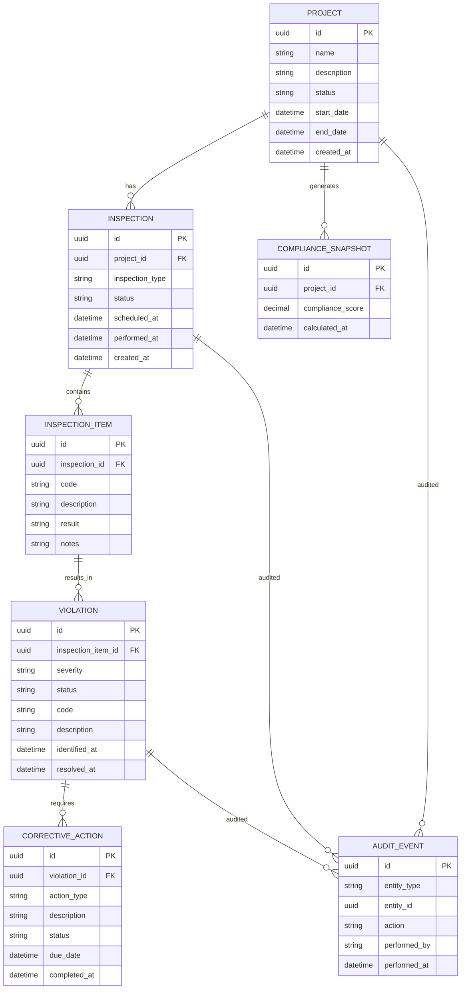

# Domain Model & Data Schema — FieldMark

**Document type:** BMAD Domain Model
**Status:** Draft v1
**Companion documents:** `project-brief.md`, `architecture-decisions.md`

---

## 0. Visual Overview (ERD)

This section provides an at-a-glance entity relationship diagram. The detailed entity catalog, state machines, and invariants follow in §1 onward.

The schema favors backend authority, explicit workflows, auditability, and cross-stack parity (.NET + Django). It is intentionally conservative and extensible, avoiding premature normalization while remaining enterprise-credible.

### Core Domain Concepts

- **Project** — A construction job or site under compliance oversight
- **Inspection** — A scheduled or performed inspection event
- **InspectionItem** — Individual checks within an inspection
- **Violation** — A failed or non-compliant finding
- **CorrectiveAction** — Required remediation steps
- **ComplianceSnapshot** — Materialized compliance calculations
- **AuditEvent** — Immutable audit trail record

### Entity Relationship Diagram



### Design Notes

- **UUID primary keys** — all entities use UUIDs; enables cross-stack parity and offline-safe identifiers
- **Explicit state fields** — `status` fields are enumerable and backend-controlled; no implicit transitions
- **Compliance as a snapshot** — score is materialized, not derived live; enables auditability and historical analysis
- **Audit events** — append-only; the `actor_id` is an opaque framework-local user reference, not a foreign key (ADR-012)
- **Schema-owned by infrastructure** — all of these tables live in the `domain` schema, created by Postgres init scripts (ADR-013, ADR-014); no framework owns or migrates them

### Deliberately Out of Scope (ERD level)

User/identity schema, roles/permissions, attachments/blobs, notification delivery, and historical versioning tables are excluded here. User and role tables are framework-local (ADR-012), not part of the shared `domain` schema; see §3.11–§3.13.

---

## 1. Purpose

This document defines the domain model for FieldMark / CCIMS in enough precision that BMAD agents can implement it equivalently in ASP.NET Core (EF Core), Django (Django ORM), or Go (Fiber + explicit SQL) without further architectural debate. It encodes:

- The entity catalog and what each entity is responsible for
- Relationships and cardinality
- State machines for entities with lifecycles
- Domain invariants that must be enforced on the server
- The compliance-scoring algorithm
- The audit-trail design
- The PostgreSQL `domain` schema definition that all three stacks map to (infrastructure-owned per ADR-014)
- A glossary of construction-compliance terminology

Per ADR-011, behavior lives on the entities. There are no domain services, no repositories, no command handlers, and no anemic data classes.

---

## 2. Bounded Context

FieldMark has one bounded context: **Compliance**. Within it, four aggregates anchor the model:

1. **Project** (root) — owns its inspections, violations, and audit entries
2. **Inspection** (root) — owns its findings and resulting violations at the moment of creation
3. **Violation** (root) — owns its corrective actions
4. **ReferenceData** (root family) — codes, categories, trade types, rule definitions

Anything that crosses aggregate boundaries goes through the aggregate root. Cross-aggregate writes happen in a single transactional unit at the request-handler level (Razor Page handler / Django view), per ADR-011.

---

## 3. Entity Catalog

### 3.1 Project (aggregate root)

The system of record for one construction engagement.

**Fields**

| Field | Type | Required | Notes |
|---|---|---|---|
| id | UUID | yes | Primary key |
| code | string(32) | yes | Human-readable identifier, unique |
| name | string(200) | yes | |
| description | text | no | |
| status | ProjectStatus | yes | enum: Active, OnHold, Closed |
| start_date | date | yes | |
| target_completion_date | date | no | |
| actual_closed_at | timestamp | no | Set when status transitions to Closed |
| compliance_score | integer | yes | Computed; 0–100 |
| created_at | timestamp | yes | |
| updated_at | timestamp | yes | |

**Behavior (methods on the entity)**

- `place_on_hold(reason: str)` — only valid from Active
- `resume()` — only valid from OnHold; returns to Active
- `close()` — only valid from Active; enforces `can_close()` invariant
- `recompute_compliance_score()` — pulls from open violations, overdue inspections; called by the rules engine on relevant transitions
- `assign_trade_scope(trade: TradeType)` — setup-only; valid only at creation time inside the same transaction that creates the project. Not exposed as a post-creation mutation in MVP.
- `assign_inspector(user: User)` — setup-only; same constraint as `assign_trade_scope`.

**Initial state**

A newly created project starts at `compliance_score = 100` (the algorithm's `base` from §6 with no penalties). The schema default of 100 is a defense-in-depth; the application sets it explicitly inside the create transaction so the value is visibly intentional.

**Invariants**

- A project may not transition to Closed while any violation in its aggregate is in state Open or InProgress.
- A project may not transition to Closed while any required inspection (per assigned trade scopes and applicable rules) has not been Completed with outcome Pass or Conditional.
- compliance_score is always ≥ 0 and ≤ 100.
- start_date ≤ target_completion_date when both are set.
- `assign_trade_scope` and `assign_inspector` may only be called inside the project-creation transaction. Post-creation mutation requires an ADR amendment and a new story.

### 3.2 JobSite

A physical location belonging to a project. A project may have one or more.

| Field | Type | Required | Notes |
|---|---|---|---|
| id | UUID | yes | |
| project_id | UUID FK | yes | |
| label | string(120) | yes | |
| address | string(300) | no | |

No lifecycle; CRUD only. Soft-deletable.

### 3.3 TradeType (reference data)

Construction trade or subsystem. Reference data, admin-managed.

| Field | Type | Required | Notes |
|---|---|---|---|
| id | UUID | yes | |
| code | string(32) | yes | unique, e.g. ELEC, PLUMB, HVAC, STRUCT |
| name | string(120) | yes | |
| description | text | no | |
| active | boolean | yes | default true |

### 3.4 Inspection (aggregate root)

A scheduled or executed inspection of a project's work in a specific trade.

| Field | Type | Required | Notes |
|---|---|---|---|
| id | UUID | yes | |
| project_id | UUID FK | yes | |
| trade_type_id | UUID FK | yes | |
| inspector_id | UUID (opaque user ref) | yes | |
| scheduled_for | timestamp | yes | |
| started_at | timestamp | no | |
| completed_at | timestamp | no | |
| status | InspectionStatus | yes | enum: Scheduled, InProgress, Completed, Cancelled |
| outcome | InspectionOutcome | no | enum: Pass, Fail, Conditional; null until Completed |
| notes | text | no | |
| created_at | timestamp | yes | |
| updated_at | timestamp | yes | |

**Behavior**

- `start(at: timestamp)` — Scheduled → InProgress; sets started_at
- `complete(outcome: InspectionOutcome, notes: str, findings: list[Finding])` — InProgress → Completed; creates Violation entities for each Fail-class finding
- `cancel(reason: str)` — only from Scheduled
- `reassign(inspector: User)` — only from Scheduled. Out of MVP UI scope (no story exposes this); implemented and unit-tested so admin tooling can call it directly. Promoting it to a UI surface is a post-MVP story.

**Invariants**

- outcome is set if and only if status == Completed.
- completed_at is set if and only if status == Completed.
- An inspector cannot be assigned to inspect their own corrective action work (see CorrectiveAction).
- A project must be Active for new inspections to transition to InProgress.

### 3.5 Finding (value object on Inspection)

Captured at the moment an inspection is completed; used to spawn violations.

| Field | Type | Required | Notes |
|---|---|---|---|
| id | UUID | yes | |
| inspection_id | UUID FK | yes | |
| violation_category_id | UUID FK | yes | |
| severity | Severity | yes | enum: Low, Medium, High, Critical |
| description | text | yes | |
| spawned_violation_id | UUID FK Violation | no | populated when violation is created |

Findings are immutable once the inspection is Completed. This is enforced at the application level (no entity method mutates a Finding belonging to a Completed Inspection); the database does not enforce it via triggers in MVP. Promotion to a schema-level constraint is post-MVP if we want defense-in-depth.

### 3.6 ViolationCategory (reference data)

Catalog of violation types. Admin-managed.

| Field | Type | Required | Notes |
|---|---|---|---|
| id | UUID | yes | |
| code | string(32) | yes | unique |
| name | string(200) | yes | |
| trade_type_id | UUID FK | no | optional restriction to a trade |
| default_severity | Severity | yes | |
| description | text | no | |
| active | boolean | yes | default true |

### 3.7 Violation (aggregate root)

A specific compliance defect on a project, originating from an inspection finding.

| Field | Type | Required | Notes |
|---|---|---|---|
| id | UUID | yes | |
| project_id | UUID FK | yes | |
| origin_finding_id | UUID FK | yes | |
| violation_category_id | UUID FK | yes | |
| severity | Severity | yes | inherits default from category but can be elevated |
| status | ViolationStatus | yes | enum: Open, InProgress, Resolved, Voided |
| opened_at | timestamp | yes | |
| due_at | timestamp | yes | computed from severity at open time |
| resolved_at | timestamp | no | |
| voided_at | timestamp | no | |
| voided_reason | text | no | |
| description | text | yes | |
| created_at | timestamp | yes | |
| updated_at | timestamp | yes | |

**Behavior**

- `assign(supervisor: User)` — Open → InProgress, OR InProgress → InProgress (re-assignment is a self-transition; emits an audit entry each time). Sets/updates the assigned supervisor.
- `submit_corrective_action(action: CorrectiveAction)` — appends to corrective_actions; only valid from InProgress
- `approve_resolution(reviewer: User, action: CorrectiveAction)` — **single canonical entry point** for resolving. InProgress → Resolved; requires the corrective action to be in state UnderReview and the reviewer to hold the Compliance Officer role. Internally calls `action.approve(reviewer)` so both transitions occur atomically. Handlers always call this method, not `CorrectiveAction.approve` directly.
- `void(admin: User, reason: str)` — Open or InProgress → Voided; admin only; voided violations do not affect compliance score
- `is_overdue(now: timestamp)` — returns true if status ∈ {Open, InProgress} and now > due_at

Rejection of a corrective action lives on `CorrectiveAction.reject` (§3.8) and does not change the parent Violation's state — it remains InProgress. There is no `Violation.reject_resolution`; the handler calls `corrective_action.reject(reviewer, notes)` directly.

**Invariants**

- A violation can only transition to Resolved through a Compliance Officer–approved CorrectiveAction.
- Voided violations require an admin actor and a non-empty voided_reason.
- due_at is set at open time using `severity_due_offset(severity)` and is not editable after.
- A violation cannot be reopened. To revive an issue, create a new violation referencing a new finding.

### 3.8 CorrectiveAction (entity within Violation aggregate)

Submission of remediation work for a violation.

| Field | Type | Required | Notes |
|---|---|---|---|
| id | UUID | yes | |
| violation_id | UUID FK | yes | |
| submitted_by_id | UUID (opaque user ref) | yes | site supervisor |
| submitted_at | timestamp | yes | |
| description | text | yes | |
| evidence_ref | string(500) | no | placeholder for file ref; out of MVP scope |
| status | CorrectiveActionStatus | yes | enum: Submitted, UnderReview, Approved, Rejected |
| reviewed_by_id | UUID (opaque user ref) | no | |
| reviewed_at | timestamp | no | |
| review_notes | text | no | |

**Behavior**

- `take_for_review(reviewer: User)` — Submitted → UnderReview; requires reviewer to be a Compliance Officer
- `approve(reviewer: User, notes: str)` — UnderReview → Approved; transitions parent violation to Resolved
- `reject(reviewer: User, notes: str)` — UnderReview → Rejected; parent violation remains InProgress

**Invariants**

- Only the latest non-Rejected CorrectiveAction of a violation may be Approved.
- The submitter and reviewer must not be the same user.

### 3.9 ComplianceRule (reference data, configurable)

Server-evaluated rule that affects compliance scoring or workflow gating.

| Field | Type | Required | Notes |
|---|---|---|---|
| id | UUID | yes | |
| code | string(64) | yes | unique, e.g. RULE_REQUIRED_INSPECTION_PER_TRADE |
| name | string(200) | yes | |
| description | text | yes | |
| rule_kind | RuleKind | yes | enum: ScoringPenalty, ClosureGate |
| parameters | jsonb | yes | rule-specific config |
| active | boolean | yes | default true |

**Rule kinds (MVP)**

- `RequiredInspectionPerTrade` (ClosureGate): each assigned trade must have ≥ 1 Completed inspection with outcome ∈ {Pass, Conditional} before project closure.
- `OpenViolationGate` (ClosureGate): no project may close while any violation is Open or InProgress.
- `OverdueViolationPenalty` (ScoringPenalty): each overdue violation reduces score by `severity_overdue_weight(severity)`.
- `OpenViolationPenalty` (ScoringPenalty): each open (not overdue) violation reduces score by `severity_open_weight(severity)`.

Rules are evaluated by the rules engine (see §6) on the server, never the client.

### 3.10 AuditEntry

Immutable, append-only log of every domain mutation.

| Field | Type | Required | Notes |
|---|---|---|---|
| id | UUID | yes | |
| occurred_at | timestamp | yes | server-set |
| actor_id | UUID (opaque user ref) | yes | |
| action | string(64) | yes | e.g. ProjectClosed, ViolationOpened, CorrectiveActionApproved |
| entity_type | string(64) | yes | |
| entity_id | UUID | yes | |
| project_id | UUID FK | no | denormalized for query convenience; null for cross-project events |
| before_state | jsonb | no | |
| after_state | jsonb | no | |
| metadata | jsonb | no | reason strings, role of actor at time of action, etc. |

Append-only. No update or delete operations. The schema enforces this via revoked privileges in production; in dev, by application convention and tests.

### 3.11 User identity (framework-local, not a shared domain entity)

User identity is **not** part of the shared `domain` schema. Per ADR-012, each stack owns its own auth schema (`django_auth`, `dotnet_auth`, `fiber_auth`) and is responsible for the identity tables it needs there. Domain rows reference users only through opaque UUID columns (`inspector_id`, `submitted_by_id`, `reviewed_by_id`, `actor_id`, `project_inspector.user_id`); there are no foreign keys from `domain.*` to any auth schema.

For MVP, each stack seeds its own user records in its own auth schema; the same UUID values are used across stacks during seeding so that audit trails remain comparable.

### 3.12 Role vocabulary (conceptual, framework-local implementation)

Roles are defined conceptually at the product level and implemented natively by each framework's authorization machinery. The shared vocabulary is:

| Code | Conceptual responsibility |
|---|---|
| `ADMIN` | System configuration, compliance-rule changes, user management |
| `COMPLIANCE_OFFICER` | Review and resolve violations; view audit history |
| `INSPECTOR` | Perform inspections, record findings |
| `SITE_SUPERVISOR` | View project compliance status, respond to violations, submit corrective actions |
| `EXECUTIVE` | Read-only access to dashboards and reports |

There is no shared `role` table. Django implements these as auth groups in `django_auth`; .NET implements them as ASP.NET Core authorization policies/roles in `dotnet_auth`; Fiber will implement them as middleware checks against `fiber_auth` records when auth is added.

### 3.13 User-role assignment (framework-local)

User-role assignment is whatever each framework's authorization system naturally provides — Django groups, ASP.NET Identity role claims, Fiber middleware lookups. There is no shared `user_role` table in `domain`.

---

## 4. Relationships (cardinality)

```
Project 1 ─── * JobSite
Project 1 ─── * Inspection
Project 1 ─── * Violation
Project 1 ─── * AuditEntry
Project * ─── * TradeType        (project_trade_scope)
Project * ─── * (opaque user_id) (project_inspector — assigned inspectors)

Inspection 1 ─── * Finding
Inspection * ─── 1 TradeType
Inspection ─── opaque user_id    (inspector_id; reference to framework-local auth)

Finding 1 ─── 0..1 Violation (spawned)

Violation * ─── 1 ViolationCategory
Violation 1 ─── * CorrectiveAction
Violation 1 ─── 1 Finding   (origin)

CorrectiveAction ─── opaque user_id  (submitted_by_id)
CorrectiveAction ─── opaque user_id  (reviewed_by_id, nullable)

AuditEntry ─── opaque user_id        (actor_id)
```

User identifiers shown as "opaque user_id" are framework-local references (ADR-012) — UUIDs sourced from `django_auth`, `dotnet_auth`, or `fiber_auth` and stored in `domain.*` without a foreign key. Role assignment is framework-local and is not represented in this diagram.

---

## 5. State Machines

### 5.1 Project

```
            ┌──────────────┐
            │   (created)  │
            └──────┬───────┘
                   │ create()
                   ▼
            ┌──────────────┐
   ┌────────│    Active    │────────┐
   │        └──────┬───────┘        │
   │               │ close()         │
   │               │ [can_close]     │
   │               ▼                 │
   │        ┌──────────────┐         │
   │        │    Closed    │         │  resume()
   │        └──────────────┘         │
   │                                 │
   │ place_on_hold()                 │
   ▼                                 │
┌──────────────┐                     │
│    OnHold    │─────────────────────┘
└──────────────┘
```

`can_close` is true iff:
- Every assigned trade has ≥ 1 Completed inspection with outcome ∈ {Pass, Conditional}
- No violation in the project is Open or InProgress

### 5.2 Inspection

```
   ┌──────────────┐
   │  Scheduled   │
   └──────┬───────┘
          │ start()
          ▼
   ┌──────────────┐
   │ InProgress   │
   └──────┬───────┘
          │ complete(outcome, findings)
          ▼
   ┌──────────────┐
   │  Completed   │
   └──────────────┘

   Scheduled ──cancel()──▶ Cancelled (terminal)
```

### 5.3 Violation

```
                        assign(supervisor)
                              ↺  (re-assign while InProgress
                                   is a self-transition; audit entry on each)
   ┌──────────┐    assign(supervisor)    ┌──────────────┐
   │   Open   │─────────────────────────▶│ InProgress   │
   └────┬─────┘                          └──────┬───────┘
        │                                        │ approve_resolution()
        │ void(admin)                            │ [delegates to action.approve()]
        ▼                                        ▼
   ┌──────────┐                          ┌──────────────┐
   │  Voided  │◀──── void(admin) ────────│   Resolved   │ (terminal)
   └──────────┘                          └──────────────┘
        ▲
        └────── (from Open or InProgress)
```

Resolved is terminal. Voided is terminal. There is no reopen path. Re-assignment while InProgress is the only legal self-loop and emits an `InspectionReassigned`-style audit entry (`ViolationAssigned`).

### 5.4 CorrectiveAction

```
   ┌──────────┐  take_for_review()   ┌──────────────┐  approve()   ┌──────────┐
   │ Submitted│─────────────────────▶│ UnderReview  │─────────────▶│ Approved │
   └──────────┘                      └──────┬───────┘              └──────────┘
                                            │ reject()
                                            ▼
                                     ┌──────────────┐
                                     │   Rejected   │ (terminal; submit a new one)
                                     └──────────────┘
```

---

## 6. Compliance Scoring Algorithm

Compliance score is a per-project integer in [0, 100]. It is recomputed by the server on:
- Violation opened
- Violation transitions to Resolved or Voided
- CorrectiveAction approved
- Inspection completed
- Daily scheduled recalc to refresh overdue status (out of MVP if scheduling is not added; trigger on read instead)

**Formula (MVP)**

```
base = 100

penalty_open = sum over violations where status == Open and not is_overdue
                  of severity_open_weight(severity)

penalty_overdue = sum over violations where status in {Open, InProgress} and is_overdue
                  of severity_overdue_weight(severity)

score = max(0, base - penalty_open - penalty_overdue)
```

**Weights (initial values, configurable via ComplianceRule.parameters)**

| Severity | open weight | overdue weight |
|---|---|---|
| Low | 1 | 3 |
| Medium | 3 | 7 |
| High | 8 | 15 |
| Critical | 15 | 30 |

**Severity-to-due-offset (for `due_at` at open time)**

| Severity | Due offset |
|---|---|
| Low | 30 days |
| Medium | 14 days |
| High | 7 days |
| Critical | 2 days |

These constants live in domain code, not in client-side configuration. Adjusting them is a server change.

---

## 7. Server-Side Authority — What the Client Never Owns

The client never:

- Computes the compliance score
- Decides whether a state transition is legal
- Determines the next legal action for an entity
- Validates required-field combinations
- Renders UI affordances (buttons, links) for actions the user is not authorized to take — the server omits them from the rendered HTML

The server always:

- Evaluates `can_*` predicates and embeds their outcome into the rendered HTML (a disabled button vs. an absent button vs. a present button)
- Recomputes derived values (compliance_score, overdue flags) inside the same transaction as the triggering write
- Writes an AuditEntry inside the same transaction as the triggering write
- Returns either the updated HTML partial (HTMX) or a structured JSON for AG Grid endpoints

---

## 8. PostgreSQL Schema Sketch

This is the canonical schema for the shared business domain. All shared tables live in the `domain` schema, which is **infrastructure-owned** per ADR-014: the schema and its tables are created by hand-authored SQL under `docker/postgres/init/`, not by EF Core, Django, or Go tooling. Frameworks map to these tables (via fluent config in EF Core, `Meta.managed = False` in Django, explicit SQL in Fiber) but never create or alter them.

The `domain` schema itself is created by `docker/postgres/init/001_schemas.sql` alongside the framework-local auth schemas (`django_auth`, `dotnet_auth`, `fiber_auth`, `infra`). The DDL below is what a follow-on infrastructure migration (e.g. `docker/postgres/init/010_domain_tables.sql`) would create. Schema drift between any stack and this canonical definition is a build-blocking defect.

User identity lives in framework-local auth schemas, not in `domain`. Per ADR-012, all domain rows reference users only through opaque UUID columns (e.g. `inspector_id`, `submitted_by_id`, `actor_id`); there are **no foreign keys from `domain.*` to any auth schema**.

```sql
-- All shared business tables live in the `domain` schema, created by infrastructure init scripts.

-- Reference data
CREATE TABLE domain.trade_type (
    id UUID PRIMARY KEY,
    code VARCHAR(32) UNIQUE NOT NULL,
    name VARCHAR(120) NOT NULL,
    description TEXT,
    active BOOLEAN NOT NULL DEFAULT TRUE
);

CREATE TABLE domain.violation_category (
    id UUID PRIMARY KEY,
    code VARCHAR(32) UNIQUE NOT NULL,
    name VARCHAR(200) NOT NULL,
    trade_type_id UUID REFERENCES domain.trade_type(id),
    default_severity VARCHAR(16) NOT NULL,
    description TEXT,
    active BOOLEAN NOT NULL DEFAULT TRUE
);

CREATE TABLE domain.compliance_rule (
    id UUID PRIMARY KEY,
    code VARCHAR(64) UNIQUE NOT NULL,
    name VARCHAR(200) NOT NULL,
    description TEXT NOT NULL,
    rule_kind VARCHAR(32) NOT NULL,
    parameters JSONB NOT NULL,
    active BOOLEAN NOT NULL DEFAULT TRUE
);

-- Identity is framework-local (see ADR-012). User identity tables live in
-- `django_auth.*`, `dotnet_auth.*`, or `fiber_auth.*`, owned by their respective
-- frameworks. The `domain` schema references users only via opaque UUID columns
-- (e.g. inspector_id, submitted_by_id, actor_id) with no foreign keys to any
-- auth schema. Conceptual roles (Administrator, Compliance Officer, Inspector,
-- Site Supervisor, Executive Viewer) are mapped to native authorization
-- constructs in each stack rather than stored as a shared `role` table.

-- Project aggregate
CREATE TABLE domain.project (
    id UUID PRIMARY KEY,
    code VARCHAR(32) UNIQUE NOT NULL,
    name VARCHAR(200) NOT NULL,
    description TEXT,
    status VARCHAR(16) NOT NULL,
    start_date DATE NOT NULL,
    target_completion_date DATE,
    actual_closed_at TIMESTAMPTZ,
    compliance_score INTEGER NOT NULL DEFAULT 100,
    created_at TIMESTAMPTZ NOT NULL DEFAULT now(),
    updated_at TIMESTAMPTZ NOT NULL DEFAULT now(),
    CHECK (compliance_score BETWEEN 0 AND 100),
    CHECK (status IN ('Active','OnHold','Closed'))
);

CREATE TABLE domain.job_site (
    id UUID PRIMARY KEY,
    project_id UUID NOT NULL REFERENCES domain.project(id) ON DELETE CASCADE,
    label VARCHAR(120) NOT NULL,
    address VARCHAR(300)
);

CREATE TABLE domain.project_trade_scope (
    project_id UUID NOT NULL REFERENCES domain.project(id) ON DELETE CASCADE,
    trade_type_id UUID NOT NULL REFERENCES domain.trade_type(id),
    PRIMARY KEY (project_id, trade_type_id)
);

-- project ↔ user assignment. user_id is an opaque framework-local identifier;
-- no FK to any auth schema (ADR-012).
CREATE TABLE domain.project_inspector (
    project_id UUID NOT NULL REFERENCES domain.project(id) ON DELETE CASCADE,
    user_id UUID NOT NULL,
    PRIMARY KEY (project_id, user_id)
);

-- Inspection aggregate
CREATE TABLE domain.inspection (
    id UUID PRIMARY KEY,
    project_id UUID NOT NULL REFERENCES domain.project(id),
    trade_type_id UUID NOT NULL REFERENCES domain.trade_type(id),
    inspector_id UUID NOT NULL,                       -- opaque user reference; no FK
    scheduled_for TIMESTAMPTZ NOT NULL,
    started_at TIMESTAMPTZ,
    completed_at TIMESTAMPTZ,
    status VARCHAR(16) NOT NULL,
    outcome VARCHAR(16),
    notes TEXT,
    created_at TIMESTAMPTZ NOT NULL DEFAULT now(),
    updated_at TIMESTAMPTZ NOT NULL DEFAULT now(),
    CHECK (status IN ('Scheduled','InProgress','Completed','Cancelled')),
    CHECK (outcome IS NULL OR outcome IN ('Pass','Fail','Conditional')),
    CHECK ((status = 'Completed') = (outcome IS NOT NULL)),
    CHECK ((status = 'Completed') = (completed_at IS NOT NULL))
);

CREATE TABLE domain.finding (
    id UUID PRIMARY KEY,
    inspection_id UUID NOT NULL REFERENCES domain.inspection(id),
    violation_category_id UUID NOT NULL REFERENCES domain.violation_category(id),
    severity VARCHAR(16) NOT NULL,
    description TEXT NOT NULL,
    spawned_violation_id UUID,
    CHECK (severity IN ('Low','Medium','High','Critical'))
);

-- Violation aggregate
CREATE TABLE domain.violation (
    id UUID PRIMARY KEY,
    project_id UUID NOT NULL REFERENCES domain.project(id),
    origin_finding_id UUID NOT NULL REFERENCES domain.finding(id),
    violation_category_id UUID NOT NULL REFERENCES domain.violation_category(id),
    severity VARCHAR(16) NOT NULL,
    status VARCHAR(16) NOT NULL,
    opened_at TIMESTAMPTZ NOT NULL,
    due_at TIMESTAMPTZ NOT NULL,
    resolved_at TIMESTAMPTZ,
    voided_at TIMESTAMPTZ,
    voided_reason TEXT,
    description TEXT NOT NULL,
    created_at TIMESTAMPTZ NOT NULL DEFAULT now(),
    updated_at TIMESTAMPTZ NOT NULL DEFAULT now(),
    CHECK (status IN ('Open','InProgress','Resolved','Voided')),
    CHECK (severity IN ('Low','Medium','High','Critical')),
    CHECK ((status = 'Voided') = (voided_at IS NOT NULL)),
    CHECK ((status = 'Resolved') = (resolved_at IS NOT NULL))
);

-- back-fill the FK from finding once violation exists
ALTER TABLE domain.finding
  ADD CONSTRAINT finding_spawned_violation_fk
  FOREIGN KEY (spawned_violation_id) REFERENCES domain.violation(id);

CREATE TABLE domain.corrective_action (
    id UUID PRIMARY KEY,
    violation_id UUID NOT NULL REFERENCES domain.violation(id),
    submitted_by_id UUID NOT NULL,                    -- opaque user reference; no FK
    submitted_at TIMESTAMPTZ NOT NULL DEFAULT now(),
    description TEXT NOT NULL,
    evidence_ref VARCHAR(500),
    status VARCHAR(16) NOT NULL,
    reviewed_by_id UUID,                              -- opaque user reference; no FK
    reviewed_at TIMESTAMPTZ,
    review_notes TEXT,
    CHECK (status IN ('Submitted','UnderReview','Approved','Rejected')),
    CHECK (submitted_by_id <> reviewed_by_id OR reviewed_by_id IS NULL)
);

-- Audit
CREATE TABLE domain.audit_entry (
    id UUID PRIMARY KEY,
    occurred_at TIMESTAMPTZ NOT NULL DEFAULT now(),
    actor_id UUID NOT NULL,                           -- opaque user reference; no FK
    action VARCHAR(64) NOT NULL,
    entity_type VARCHAR(64) NOT NULL,
    entity_id UUID NOT NULL,
    project_id UUID REFERENCES domain.project(id),
    before_state JSONB,
    after_state JSONB,
    metadata JSONB
);

CREATE INDEX idx_audit_entity ON domain.audit_entry (entity_type, entity_id);
CREATE INDEX idx_audit_project ON domain.audit_entry (project_id, occurred_at DESC);

-- Useful indexes
CREATE INDEX idx_inspection_project_status ON domain.inspection (project_id, status);
CREATE INDEX idx_violation_project_status ON domain.violation (project_id, status);
CREATE INDEX idx_violation_due ON domain.violation (due_at) WHERE status IN ('Open','InProgress');
```

**Cross-stack notes**

- The `domain` schema is created by `docker/postgres/init/001_schemas.sql` alongside `django_auth`, `dotnet_auth`, `fiber_auth`, and `infra` (ADR-013). The DDL above is authored as additional infrastructure migration files in the same directory and is the only mechanism by which `domain.*` tables come into existence.
- EF Core, Django ORM, and Fiber data access **map** to these tables; they do not create them. EF Core uses `ToTable("project", "domain")` plus `UseSnakeCaseNamingConvention()`. Django uses `Meta.managed = False` and an explicit cross-schema `db_table` reference. Fiber writes explicit SQL against `domain.<table>`.
- All three stacks map enum-like fields to VARCHAR with CHECK constraints rather than PostgreSQL native ENUM types. Native enums make schema evolution painful and migrate inconsistently across stacks.
- UUIDs are generated in application code (not via `gen_random_uuid()`) so behavior is identical across stacks.
- All timestamps are TIMESTAMPTZ. UTC at the database; local rendering at the UI.
- Partial indexes (e.g., `idx_violation_due ... WHERE status IN ('Open','InProgress')`) are part of the infrastructure migration. EF Core (`HasFilter(...)`) and Django (`Index(condition=...)`) are configured to *expect* this index without re-creating it; Fiber simply queries against it. A `pg_indexes` snapshot is the cross-stack truth.
- The `corrective_action` `CHECK (submitted_by_id <> reviewed_by_id OR reviewed_by_id IS NULL)` is defense-in-depth. Primary enforcement happens in `CorrectiveAction.take_for_review` (§3.8 invariant). The CHECK protects against direct SQL or migration mistakes.
- Join tables `domain.project_trade_scope` and `domain.project_inspector` exist physically in the schema. ORMs in .NET and Django can model the project-trade relationship as many-to-many; `domain.project_inspector` is a join over an opaque `user_id` (not a FK) and is best modeled in each stack as an explicit assignment entity, not an ORM-managed M2M to a user table.

---

## 9. Naming Conventions

Django is more opinionated about naming than .NET and its conventions align with PostgreSQL community norms. **Django's `snake_case` is therefore the canonical form** for all database-level and wire-format names. .NET maps its idiomatic `PascalCase` to that canonical form explicitly via ORM configuration; Fiber writes SQL directly against the canonical form. A schema diff across all three stacks must produce zero naming differences.

### Database schema and table names

Shared business tables live in the **`domain`** schema (ADR-014); their names are **`snake_case`** — e.g. `domain.project`, `domain.inspection`, `domain.violation`, `domain.corrective_action`. Framework-local auth tables live in `django_auth.*`, `dotnet_auth.*`, or `fiber_auth.*` and follow the same `snake_case` convention.

- **Django:** override the default `<app>_<model>` prefix by setting `db_table` and configure the schema by quoting it (or via the project's adopted `search_path` / cross-schema convention). Domain models also set `managed = False`:
  ```python
  class Meta:
      managed = False
      db_table = 'domain"."project'
  ```
- **.NET:** set the schema and table name explicitly in fluent configuration. The schema argument is mandatory — a `ToTable("project")` without the schema would default to `public` and is incorrect:
  ```csharp
  modelBuilder.Entity<Project>().ToTable("project", "domain");
  ```
- **Go (Fiber):** all SQL references the table in fully qualified form (`domain.project`). There is no naming-convention layer to configure.

### Database column names

All columns use **`snake_case`** — e.g. `compliance_score`, `started_at`, `project_id`.

- **Django:** natural; field names are already `snake_case`.
- **.NET:** apply `UseSnakeCaseNamingConvention()` globally (via the `EFCore.NamingConventions` package) so all properties map automatically:
  ```csharp
  protected override void OnConfiguring(DbContextOptionsBuilder optionsBuilder)
      => optionsBuilder.UseSnakeCaseNamingConvention();
  ```
- **Go (Fiber):** SQL is hand-written against the existing `snake_case` columns; no convention layer is needed.

### Entity / model / struct names

**`PascalCase`** across all stacks — e.g. `Project`, `CorrectiveAction`. This is natural for C#, Python, and exported Go identifiers.

### Field / property names in code

- **Django:** `snake_case` — natural.
- **.NET:** `PascalCase` in C# — e.g. `ComplianceScore`, `StartedAt`. The ORM configuration (above) bridges to the `snake_case` column name automatically.
- **Go (Fiber):** exported struct fields are `PascalCase` (`ComplianceScore`, `StartedAt`); SQL queries reference the underlying `snake_case` columns directly. Map struct tags or scan helpers bridge the two.

### Enum storage and wire format

All enum values are stored in the database and returned on the wire as **`SCREAMING_SNAKE_CASE` strings** — e.g. `PROJECT_MANAGER`, `IN_PROGRESS`, `COMPLIANCE_OFFICER`.

- **Django:** define enums as `TextChoices`; the choice value is the stored string:
  ```python
  class Status(models.TextChoices):
      IN_PROGRESS = "IN_PROGRESS"
      RESOLVED = "RESOLVED"
  ```
- **.NET:** use a value converter to map the C# enum to its string constant:
  ```csharp
  builder.Property(v => v.Status)
         .HasConversion<string>();
  // and configure globally: .HasConversion(e => e.ToString(), s => Enum.Parse<ViolationStatus>(s))
  ```
  Enum member names in C# must exactly match the `SCREAMING_SNAKE_CASE` string or a converter must be explicit.
- **Go (Fiber):** define enums as named string types with constants whose values are the `SCREAMING_SNAKE_CASE` strings; scan and bind directly as strings.

### Domain method names

The **canonical list of state-transition methods** (see §3 entity catalog) uses `snake_case` as the ground truth, since that is Django's natural casing. The .NET and Go equivalents are the `PascalCase` counterparts — 1:1 mappings with no divergence in semantics.

| Canonical (`snake_case`) | .NET / Go (`PascalCase`) |
|---|---|
| `start` | `Start` |
| `complete` | `Complete` |
| `cancel` | `Cancel` |
| `place_on_hold` | `PlaceOnHold` |
| `resume` | `Resume` |
| `close` | `Close` |
| `assign` | `Assign` |
| `submit_corrective_action` | `SubmitCorrectiveAction` |
| `approve_resolution` | `ApproveResolution` |
| `reject_resolution` | `RejectResolution` |
| `void` | `Void` |

### JSON field names (AG Grid and HTMX endpoints)

All JSON response fields use **`snake_case`** — e.g. `{ "compliance_score": 87, "last_row": 100 }`.

- **Django:** natural via Django's serialization defaults.
- **.NET:** configure `System.Text.Json` globally in `Program.cs`:
  ```csharp
  builder.Services.Configure<JsonOptions>(o =>
      o.SerializerOptions.PropertyNamingPolicy = JsonNamingPolicy.SnakeCaseLower);
  ```
- **Go (Fiber):** use `snake_case` `json:"..."` struct tags on response DTOs.

---

## 10. Domain Glossary

| Term | Definition |
|---|---|
| Project | A construction engagement tracked end-to-end in FieldMark. The system of record. |
| Job site | A physical location belonging to a project. |
| Trade / trade type | A construction discipline (Electrical, Plumbing, HVAC, Structural, etc.). |
| Trade scope | The set of trades active on a project. Drives required-inspection rules. |
| Inspection | A scheduled or completed review of a project's work in a specific trade by an inspector. |
| Outcome | The result of a completed inspection: Pass, Fail, or Conditional. |
| Conditional | An inspection outcome indicating compliance pending a minor remediation; does not block project closure. |
| Finding | A specific issue observed during an inspection. May spawn a violation. |
| Violation | A compliance defect with a lifecycle. Originates from an inspection finding. |
| Severity | A violation's impact rating: Low, Medium, High, Critical. Drives due dates and scoring weights. |
| Overdue | A violation whose due_at is in the past and whose status is not terminal. |
| Corrective action | A site supervisor's submission of remediation work for a violation. |
| Voided | A violation cancelled by an admin (e.g., recorded in error). Does not affect compliance score. |
| Compliance score | A per-project 0–100 metric computed by the server from open and overdue violations. |
| Compliance rule | A server-evaluated rule that either gates a workflow transition or contributes a scoring penalty. |
| Closure gate | A rule that blocks project closure (e.g., open violations). |
| Audit entry | An immutable log record of a domain mutation. |
| Aggregate | A cluster of entities with one root, transactional boundaries enforced at the root. |

---

## 10. What This Document Deliberately Excludes

- File upload/storage strategy (out of MVP scope)
- Notification mechanics (out of MVP scope)
- Tenant isolation / multi-tenancy (single tenant assumed)
- Workflow approval chains beyond the single Compliance Officer review
- Time-series compliance score history (the score is current-state; the audit log is the history)

If any of these are needed later, they are post-MVP additions and trigger a new ADR.
