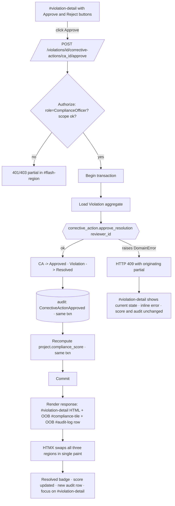
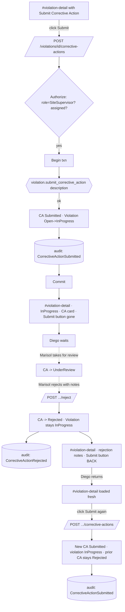
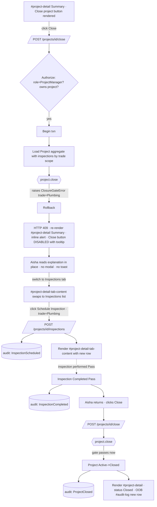
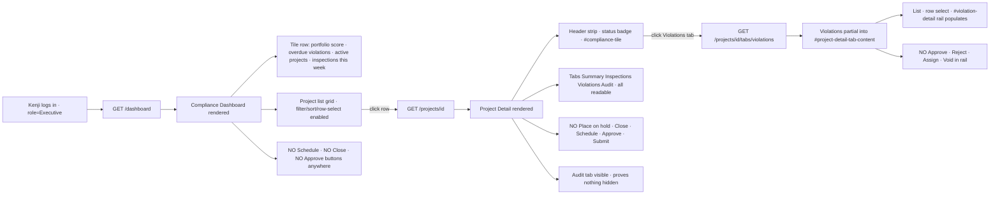

# UX Design Specification — FieldMark

**Author:** Tim
**Date:** 2026-05-10

---

<!-- UX design content will be appended sequentially through collaborative workflow steps -->

## Executive Summary

### Project Vision

FieldMark is a construction compliance & inspection management system that demonstrates server-authoritative architecture as a viable alternative to SPAs at enterprise scale. Implemented three times — .NET (Razor Pages), Django (Templates), Go (Fiber) — against one shared PostgreSQL domain schema, with HTMX for interactivity and AG Grid as a scoped JavaScript island. The UX must serve two audiences at once: in-app personas performing realistic compliance workflows, and a skeptical engineering audience who must come away convinced the architecture matches SPA-equivalent interaction smoothness without the SPA's complexity.

The UX north star: *the interface does not negotiate with users — it reflects decisions already made by the system.* Calm, authoritative, inevitable. The strongest UX success criterion is not delight; it is **trust**.

### Target Users

**Marisol — Compliance Officer (anchor persona).** Reviews and approves/rejects corrective actions across a portfolio of active projects. Dashboard → Project Detail → Violation → Approve is the canonical demo flow. Needs portfolio-level visibility and a single screen per project where truth and action coexist.

**Diego — Site Supervisor.** Submits corrective actions against violations assigned to his crew. Sees only what is his; cannot resolve violations himself. Encounters rejection-and-resubmission as a first-class flow.

**Aisha — Project Manager.** Owns project lifecycle (start, place on hold, resume, close). Encounters closure-gate denial as a designed UX moment: HTTP 409, originating partial re-renders with inline explanation, Close button visibly disabled with tooltip until prerequisites are met.

**Kenji — Executive Oversight (read-only).** Portfolio risk monitoring. Every action button is *absent* for his role — not disabled, not hidden by CSS, simply not rendered by the server. Audit log is fully visible to prove nothing has been hidden.

**Reference-Data Admin (off-demo).** Manages TradeType, ViolationCategory, ComplianceRule. Minimal UX, treated as a platform concern rather than a product experience. Django uses Django Admin; .NET and Go provide minimal capability-matched pages.

**The Talk Audience (meta-persona).** A skeptical mid-to-senior engineer with years of React/Angular experience. Their conversion moment is one click: an Approve action fires, and in a single visible round trip the violation status, the out-of-band compliance score tile, and a new audit row all update — with no spinner, no flicker, and no JavaScript orchestrating the change.

### Key Design Challenges

1. **SPA-equivalent interaction smoothness from server-authoritative HTML.** ≤ 200 ms p95 partial-swap perceived latency, ≤ 300 ms p95 grid-row-to-detail load, no full-page reload on any state-changing action, OOB tile updates land in the same round trip as the triggering action. Any perceptible jank undermines the architectural thesis.
2. **Server authority must be visible in the rendered UI.** Action buttons are absent, disabled, or present — and the server makes that call. The UI must show *why* an action is blocked (inline rule-violation explanation, disabled-button tooltips, HTTP 409 re-rendering the originating partial) without leaking domain logic to the client.
3. **WCAG 2.1 AA conformance across HTMX swaps.** Focus management on meaningful swaps, `aria-live` on OOB regions and the global `#flash-region`, `hx-disabled-elt` for in-flight states, `aria-invalid` + `aria-describedby` for 409 error rendering. Enforced by `@axe-core/playwright` runs on every E2E scenario across all three stacks.
4. **AG Grid as a scoped island, never a wedge.** Server-side row model only; row selection fires an HTMX request that loads the detail panel; the grid never owns the detail view, never holds business logic, never duplicates server state.
5. **Three-stack UX parity.** Identical HTMX target IDs, identical partial root-element shapes, identical audit-row rendering, identical interaction timing across .NET / Django / Go. A divergent UX detail in any stack is a defect, not a stylistic choice.
6. **Desktop-first (≥1280px) with credible tablet support.** Site supervisors on tablets are a real use case; mobile is acknowledged-poor by design (AG Grid in narrow viewports is a known constraint).

### Design Opportunities

1. **The "one round trip, three regions" moment as the signature interaction.** Treat Approve / Resolve / Close as designed demo beats. Every detail — focus shift, score-tile transition, audit row appearance, absence of any spinner — is choreography in service of trust. This is the screen the talk turns on.
2. **Inline rule-violation rendering as a competitive UX advantage over the SPA default.** Most enterprise apps surface "you can't do that" via a toast or modal that the user dismisses. FieldMark renders the explanation in the originating partial, with the disabled-button tooltip explaining why. Calmer, more authoritative, and — because it is in-DOM rather than ephemeral — more accessible.
3. **Role-scoped affordance rendering as enterprise calm.** Kenji never sees an Approve button. Diego never sees an Approve button. The UI *is* the permission model — no grayed-out clutter, no "you don't have permission" errors, no negotiation between the user and the system.
4. **The Project Detail anchor screen as the system's spine.** Status, compliance score, inspections, violations, audit log — one screen, current truth, tabs as HTMX swaps rather than client routes. Investing disproportionately in this screen's clarity, density, and interaction precision is higher leverage than any other surface in the product.

## Core User Experience

### Defining Experience

FieldMark's value collapses to one repeated motion: **a privileged user opens the relevant detail screen, sees current truth, takes one server-authoritative action, and watches the affected regions update in a single round trip.** Everything else — navigation, dashboards, lists, audit — exists in service of that motion.

The canonical instance is Marisol's **Approve Corrective Action** click. In one HTTP round trip:
- The violation status flips Open/InProgress → Resolved.
- The out-of-band compliance score tile in the page header updates.
- A new `CorrectiveActionApproved` row appears in the Audit tab.

No spinner long enough to register. No client-side orchestration. No follow-up request. This single interaction is the canonical demo beat, the canonical accessibility test, the canonical cross-stack parity gate, and the canonical proof that the architecture holds. If it is wrong, the talk fails. If it is right, every other surface in the product is supporting cast.

### Platform Strategy

- **Application type:** Server-rendered multi-page web application with HTMX partial updates. AG Grid loaded as a scoped JavaScript island for data-dense list views. No SPA, no PWA, no service worker, no offline mode, no client-side routing, no client-side state stores.
- **Primary input:** Mouse and keyboard. All workflows fully keyboard-operable.
- **Primary viewport:** Desktop browsers ≥ 1280px. All workflows designed and tested at this width.
- **Secondary viewport:** Tablet ≥ 768px (Tailwind `md:` / `lg:` collapse). Site supervisors using a tablet on-site is a credible use case; HTMX partials and AG Grid remain functional. Touch interaction must work; layouts must not break.
- **Tertiary viewport:** Mobile < 768px. The site does not break, but UX is not optimized. AG Grid in narrow viewports is acknowledged-poor by design.
- **Browser matrix:** Last 2 stable versions of Chrome, Firefox, Safari, Edge. A feature working in Chromium but not Safari is a defect, not a tradeoff.
- **Three-stack parity is platform-level:** the same screen rendered by .NET, Django, and Go must be visually and behaviorally indistinguishable to a user. Divergence is a defect, not a stylistic choice.
- **No build pipeline beyond Tailwind.** Compiled CSS is committed; no webpack/Vite/esbuild for application code.
- **Authentication required on every route** except a single public landing page (no business content).

### Effortless Interactions

These are the interactions that must require zero conscious thought from the user:

1. **Acting on a violation from the dashboard.** Dashboard row → Project Detail → Violations tab → Approve / Reject. Three clicks maximum, no full-page reloads, no perceptible spinner.
2. **Understanding why an action is unavailable.** Closure denial, role-restricted action, state-incompatible transition — explanation rendered inline in the partial the user is already looking at. Never a modal, never a toast.
3. **Reading the audit trail.** Chronological, immutable, with action strings (`CorrectiveActionApproved`, `ProjectClosed`, etc.) that match the user's mental model of what they did. Zero translation required.
4. **Switching between Project Detail tabs.** Summary / Inspections / Violations / Audit must feel like client-side tabs even though they are HTMX swaps. No URL flicker, no layout shift, focus lands sensibly inside the swapped panel.
5. **AG Grid row → detail panel.** Single click, panel populates inline within ≤ 300 ms p95. No navigation, no second click required.
6. **First render after login.** Role-correct affordances present from the first paint. The user never sees an action they can't take and never encounters a permission error in normal use.

### Critical Success Moments

The interactions on which the architectural thesis is judged. Each is a designed demo beat, not an emergent behavior.

1. **The "three regions, one round trip" moment (Approve / Resolve).** A single HTMX request returns a partial that updates the violation status, the OOB compliance score tile in the page header, and the audit log. No follow-up request. No client orchestration. No spinner long enough to register. **This is the hinge of the talk.**
2. **The 409 + originating partial moment (Closure denial).** Aisha clicks Close on a project missing a required Plumbing inspection. Server returns HTTP 409 with the Project Detail partial re-rendered: explanation inline, Close button visibly disabled with a tooltip stating the missing prerequisite, project status unchanged. The user learned the rule from the UI without ever reading documentation. **No modal, no toast, no client validation.**
3. **The role-scoped first render (Executive read-only).** Kenji logs in. Every action button is *absent* — not greyed out, not hidden by CSS, simply not rendered by the server. The page is information, not affordance. He cannot encounter a permission error because the UI does not offer him actions he cannot take.
4. **The rejection-resubmission cycle.** Diego's corrective action is rejected. The rejection note is visible. The **Submit Corrective Action** button is back. The violation remains InProgress (rejection does not revert state). The state machine is legible from the UI alone, with no documentation reference required.
5. **Tab-swap continuity on the Project Detail anchor screen.** Switching between Summary / Inspections / Violations / Audit must feel continuous. If a tab swap reads as a navigation, the anchor-screen metaphor breaks and the talk loses its visual centerpiece.
6. **Cross-stack identical interaction.** The same scenario performed in the .NET, Django, and Go demos is visually and temporally indistinguishable. The framework is the variable; the experience is the constant.

### Experience Principles

These principles are load-bearing and govern every UX decision downstream.

1. **The system owns truth — the UI projects it.** No client-side drafts, no optimistic updates, no state the server doesn't know about. Every screen reflects the database as of the last successful response.
2. **Affordance is a server decision.** Buttons are absent, disabled, or present — and the server makes that call on every render. The UI *is* the permission and state model, made visible.
3. **One round trip, three regions.** A meaningful state change updates exactly the regions that depend on it — primary partial, OOB tile, audit row — in a single HTTP response. No follow-up requests, no client coordination.
4. **Errors render in place, not in modals.** Domain rule violations return HTTP 409 with the originating partial re-rendered, the explanation inline, state unchanged. Calmer, more accessible, more honest than a toast.
5. **HTMX chooses the transport; WCAG governs the semantics.** `hx-post` on a `<button>` is right; on a `
` it is wrong. The two decisions are independent and both are made deliberately.
6. **Three stacks, one experience.** Routes, target IDs, partial root-element shapes, audit-row markup, interaction timing — identical across .NET, Django, and Go. A user-visible divergence is a defect.
7. **Enterprise calm over visual delight.** Minimal animation, predictable layouts, readable density. The interaction *feels* good because it is fast, stable, and trustworthy — not because it is decorated.

## Desired Emotional Response

### Primary Emotional Goals

The primary emotional goal is **trust through inevitability**. The user should feel that what the screen says is what the system *is* — that the action they took actually happened, that the rules they encountered are real and consistently applied, that nothing is happening off-screen. This is not "delight" in the consumer-product sense. It is something rarer in enterprise software: the absence of the low-grade dread that normally accompanies it.

The emotional thesis serves both audiences simultaneously and identically. Marisol trusts the data because the audit row is there before her round trip ends. The skeptical engineer in the talk audience trusts the architecture because there was no JavaScript orchestrating that audit row's appearance. Same emotion, same evidence, different interpretation.

The strongest possible emotional outcome is for the architecture to **recede behind the work** — for the user to stop noticing the tool.

### Emotional Journey Mapping

| Stage | Compliance Officer | Project Manager | Site Supervisor | Executive | Talk Audience |
|---|---|---|---|---|---|
| First load | Oriented — "I can see the work" | Oriented — "I can see the portfolio" | Focused — "Here's what's mine" | Calm — "Here's the risk" | Curious — "Looks normal so far" |
| Core action | Confident — "I know this is right" | Informed — "Server told me why" | Purposeful — "I can fix this" | (read-only) | Surprised — "Wait, that was one request?" |
| Post-action | Settled — "It's done, the audit shows it" | Patient — "Now I know what to schedule" | Accountable — "It's in the system" | Reassured — "Nothing is hidden" | Reorienting — "How did that work?" |
| Error / denial | Clear — "I see exactly why" | Informed — "The rule is visible, not buried" | Not blamed — "The system told me, calmly" | (n/a) | Convinced — "The error rendered in place, not as a modal" |
| Returning | Anchored — "Same place I left it" | Anchored | Anchored | Anchored | Curious enough to clone the repo |

### Micro-Emotions

The micro-emotional pairs that govern detail-level UX decisions:

- **Trust over Skepticism.** Every render is the database. No client-state staleness. Audit log visible to anyone with read access. Trust is built through evidence, not assertion.
- **Confidence over Confusion.** Affordances are present, disabled, or absent — never ambiguous. Disabled buttons explain *why* via tooltip. The state machine is legible from the UI alone.
- **Calm over Anxiety.** No spinners long enough to register, no full-page reloads, no toasts that vanish before they're read, no modals that interrupt the workflow. The interface does not produce stress signals.
- **Accountability over Blame.** When the system rejects an action (closure denial, corrective action rejection), it informs rather than scolds. The rejection lives in the partial, the rationale is visible, the next valid action is obvious.
- **Inevitability over Delight.** The goal is not to make Marisol smile. The goal is for her to stop noticing the tool. The architecture recedes behind the work.

**Emotions deliberately avoided:**
- **Surprise** at what the system did — every state change is visible immediately, nothing happens off-screen.
- **Doubt** about whether the action took effect — the triplet (status + score tile + audit row) is the receipt.
- **Negotiation** with the interface — no "are you sure?" dialogs on routine actions, no permission errors mid-flow, no client-side validation arguing with the server.
- **Performative work** — no decorative animations that suggest the tool is "doing something" when it isn't.

### Design Implications

| Desired feeling | UX consequence |
|---|---|
| Trust | OOB compliance score tile updates in the same round trip; audit row visible immediately; no client-state caching |
| Confidence | Server-decided absent/disabled/present buttons; tooltips on disabled actions explaining the blocking rule; legible state badges with consistent vocabulary |
| Calm | No spinners on sub-200ms requests; no full-page reloads; minimal animation; predictable layouts; one round trip for related updates |
| Accountability (not blame) | HTTP 409 + originating partial with inline explanation; rejection notes visible in the corrective action history; next-valid-action obvious from the rendered UI |
| Inevitability | Rendered HTML *is* the permission and state model; no client-side surprises; cross-stack identical interaction feel |
| Focus | Anchor-screen pattern (Project Detail = current truth in one view); HTMX tab swaps that don't read as navigations |

### Emotional Design Principles

1. **Trust is built in the receipt, not in the request.** What the user sees after the round trip is what makes them trust the system. Invest disproportionately in the post-action render — the simultaneity of status flip, OOB tile update, and audit row appearance is the trust mechanism, not a nice-to-have.
2. **Calm is the absence of unnecessary signals.** No spinner unless the request is genuinely slow. No animation unless it carries information. No modal unless action is required outside the current flow. Subtraction is design work.
3. **The system informs; it does not scold.** Rule violations and denials render with rationale, not reproach. The tone is "here is what is true," never "you did the wrong thing." Diego is not blamed for a rejected corrective action; he is told what was missing.
4. **Affordance ambiguity is a defect.** A button must read clearly as available, unavailable-with-reason, or not-applicable-to-you. There is no fourth state. Greyed-out-without-explanation is forbidden.
5. **Inevitability over delight.** The user's strongest possible emotional response is to stop noticing the tool. The architecture recedes behind the work. This principle outranks any "moment of delight" instinct downstream.

## UX Pattern Analysis & Inspiration

### Inspiring Products Analysis

**Linear** — the reference for calm + dense + fast in an enterprise tool. Keyboard-first, instant response, no decorative animation. Status changes feel atomic: one click flips state, the row updates, the activity log adds an entry, dependent counts update. This is the SPA-delivered version of FieldMark's "three regions, one round trip" pattern. Lessons: visual calm, density without clutter, the sense that the tool is faster than the user's brain. The per-entity activity log maps directly onto FieldMark's per-project audit log.

**GitHub (Issues / Pull Requests)** — the canonical activity-log-as-narrative pattern, plus the canonical "disabled merge button with inline explanation" pattern. The merge button's availability is server-decided based on reviews, checks, and branch protection; the rejection rationale renders in place, not in a modal. The PR detail's tabs (Conversation / Commits / Checks / Files) are the spiritual ancestor of FieldMark's Project Detail anchor screen.

**Stripe Dashboard** — the reference for read-heavy enterprise data UX. Dense tables that don't feel cluttered, filters visible without being loud, status badges with consistent color semantics, detail panels that load inline without the list disappearing. Empty and error states receive the same care as happy paths. The list-and-detail co-presence pattern maps directly onto AG Grid + HTMX detail panel.

**HEY / Basecamp (Hotwire/Turbo)** — proof that server-rendered + restrained interaction can read as premium rather than dated. Same architectural pattern as HTMX (server returns HTML, partial swaps drive interactivity). Transitions are fast and quiet; no animation that doesn't carry information. Lesson: the architecture FieldMark is arguing for has already been validated as a premium product experience by adjacent teams.

**Phoenix LiveView demos** — FieldMark's closest architectural cousin. Same thesis: server owns truth, UI is a projection, real-time-feeling updates without client state. Their best demos work because post-action feedback (state flip + dependent regions updating) is instantaneous and visible. Lesson: this architectural pattern *can* deliver the "wait, that was one request?" moment the talk hinges on.

**Datadog / Grafana dashboards** — the reference for the Compliance Dashboard pattern. Tile-based summary at the top, drill-down into specifics below, filters that scope everything on the page. Tiles update independently — the canonical out-of-band swap model. Each tile answers exactly one question, which is the discipline FieldMark's dashboard must adopt.

### Transferable UX Patterns

**Navigation**
- **Anchor screen with tab swaps** (GitHub PR, Linear issue detail) → Project Detail with HTMX-driven Summary / Inspections / Violations / Audit tabs.
- **Portfolio dashboard → drill-down to entity detail** (Stripe, Linear, Datadog) → Compliance Dashboard → Project Detail.
- **List + detail co-present** (Stripe, Linear) → AG Grid + HTMX detail panel.

**Interaction**
- **Inline state-change controls with server-decided availability** (GitHub merge button, Linear status picker) → direct mapping to FieldMark's absent/disabled/present rule.
- **Unified timeline / activity log per entity** (GitHub, Linear, Stripe events) → direct mapping to per-project audit log.
- **OOB updates of dependent regions after a related action** (Linear count badges updating after an issue closes) → direct mapping to compliance score tile updates.
- **Disabled-with-tooltip-explanation** (GitHub merge gating, Linear constraint feedback) → direct mapping to FieldMark's closure-gate UX (with the addition that the explanation also renders inline in the partial after a 409, not only in the tooltip).

**Visual**
- **Status badges with stable color semantics** (Stripe, Linear) → adopt as canonical badge vocabulary across all entity states.
- **Restrained typography, generous whitespace, dense-but-calm tables** (Linear, Stripe) → matches Basecoat defaults; informs Tailwind usage discipline.
- **Tile-based dashboards where each tile answers one question** (Datadog, Grafana, Stripe) → governs Compliance Dashboard composition.

### Anti-Patterns to Avoid

- **Toast-only error reporting.** Disappears before users read it; inaccessible to many screen reader users; conflicts with the "inform, don't scold" principle. FieldMark renders errors inline in the originating partial; `#flash-region` is reserved for non-blocking announcements.
- **Modal-driven workflows for routine actions.** Interrupts focus, hides context, fights the anchor-screen pattern. Modals are reserved for genuinely outside-the-flow actions — likely none in MVP.
- **"Are you sure?" confirmations on every state-changing action.** Trains users to click through without reading; adds anxiety; signals the system doesn't trust itself. Reserved for irreversible destructive operations only.
- **Spinners as decoration.** A spinner that always shows for 200ms regardless of actual latency is a stress signal, not a status signal. Indication appears only when the request is genuinely slow (use `hx-disabled-elt` for the in-flight state).
- **Greyed-out controls without explanation.** A disabled button with no tooltip is a dead end. Forbidden: every disabled control carries an explanation.
- **Permission errors mid-flow.** If a button is rendered, the system has already promised the action is available. Permission errors after click are a contract violation. The solution is to not render the button.
- **Client-side optimistic updates.** Looks fast, then snaps back when the server disagrees. Breaks trust. The "one round trip, three regions" pattern is the better default.
- **Heavy animation as a proxy for "modern."** Slows perceived responsiveness, creates motion-sickness accessibility issues, doesn't carry information. Calm > kinetic.
- **Multipurpose dashboards.** Screens that try to answer five questions answer none well. Each FieldMark screen answers exactly one question.

### Design Inspiration Strategy

**Adopt directly**
- Linear's calm + density + speed as the overall feel target.
- GitHub's anchor-screen-with-tabs and unified-timeline-per-entity as the structural template for Project Detail.
- Stripe's badge vocabulary and list+detail co-presence as the data-display template.
- Datadog's tile-based summary as the Compliance Dashboard template.
- HEY / Basecamp / Hotwire-Turbo's motion discipline — no animation unless it carries information.

**Adapt**
- GitHub's "disabled merge button with explanation" → FieldMark's closure-gate renders the explanation *both* inline in the returned partial *and* on the disabled-button tooltip. Tooltip-only is invisible until hover; immediate visibility after a 409 is required.
- Linear's status pickers → adapt to FieldMark's state-machine semantics with named transitions (`start`, `complete`, `cancel`, `place_on_hold`, `resume`, `close`, `assign`, `submit_corrective_action`, `approve_resolution`, `reject_resolution`, `void`) rather than free-form status changes.
- Stripe's filter chrome → adapt to AG Grid's server-side row model.
- LiveView's instant-feel updates → deliver via HTMX `hx-swap-oob`; users should not be able to tell the architectural difference from the interaction feel.

**Avoid (anti-patterns from above)**
- Toast-only errors, modal workflows for routine actions, confirmation dialogs on routine actions, decorative spinners, greyed-out without explanation, heavy animation, multipurpose dashboards, mid-flow permission errors, client-side optimistic updates.

## Design System Foundation

### Design System Choice

**Basecoat ([basecoatui.com](https://basecoatui.com/)) is FieldMark's canonical component vocabulary**, pinned to a single exact version across all three stacks.

Basecoat is a framework-agnostic, Tailwind v4–native component library that delivers the shadcn/ui design language as plain HTML and CSS. It requires no JavaScript framework, ships only minimal vanilla JS for the few interactive components that need it, and produces byte-identical markup across Razor, Django templates, and Go `html/template`.

**Version status (important).** Basecoat is currently pre-1.0 — at the time of this specification the latest tagged release is `0.3.11` ([github.com/hunvreus/basecoat](https://github.com/hunvreus/basecoat)). Pre-1.0 implies breaking changes are likely between minor versions. FieldMark accepts this risk because (a) the alternative is custom-from-raw-Tailwind, which carries equal-or-greater ongoing cost spread across three stacks; (b) FieldMark is a teaching artifact whose upgrade cadence is controllable; and (c) the carve-outs below mean we depend on Basecoat's CSS more than its JS, narrowing the breakage surface.

The mitigation is operational, not architectural: pin to an exact patch version (no `^` or `~` ranges); treat any Basecoat upgrade as a coordinated three-stack story with mandatory visual-regression review (see Quality Gates); and re-evaluate the dependency at Basecoat 1.0.

### Rationale for Selection

1. **Framework-agnostic plain-HTML API.** Cross-stack parity becomes mechanically achievable rather than a perpetual review burden — the same Basecoat markup renders identically from every stack.
2. **Tailwind v4 native.** The existing `fieldmark_shared/` pipeline absorbs Basecoat without architectural change.
3. **shadcn-derived design language.** Calm, neutral, restrained, accessible defaults — the "enterprise calm" register the emotional principles require, without designing it from scratch.
4. **No JS framework dependency.** Compatible with HTMX-first server rendering; the small vanilla JS Basecoat ships does not fight HTMX patterns.
5. **Cheapest viable solution to consistent component vocabulary across three stacks.** Building custom against raw Tailwind would introduce three-way divergence we'd then have to police.

**Alternatives considered and rejected:**
- Custom-from-raw-Tailwind — too much ongoing design and parity-policing cost; the destination would converge on Basecoat-shaped output anyway.
- Material Design / Ant Design — visually heavier, motion language fights "calm," opinionated behaviors fight server-authoritative patterns.
- shadcn/ui — React-only, non-starter for our three stacks.
- Bootstrap — visual register reads as dated and works against the "modern teaching artifact" framing.
- Tailwind UI — licensing awkward across three open-source stacks; we don't need the marketing-page components.

### Implementation Approach

- **Source of truth:** `fieldmark_shared/src/fieldmark.css` imports Basecoat's CSS plus project-level overrides defined in Step 8 (Visual Foundation).
- **Build:** Tailwind v4 compiles to `fieldmark_shared/dist/fieldmark.css`; the compiled artifact is committed and symlinked into each stack's static directory. No per-stack CSS authoring.
- **Versioning:** Basecoat version is pinned to an **exact** version (no semver ranges) in `fieldmark_shared/package.json` and recorded in the architecture doc alongside HTMX and AG Grid version pins. Upgrades are coordinated three-stack stories with mandatory visual-regression review. Re-evaluate the pinning policy at Basecoat 1.0.
- **Component templates:** each stack maintains a small `partials/components/` directory of thin wrappers (e.g., `_button.cshtml` / `_button.html` / `button.tmpl`) emitting Basecoat-compliant markup with FieldMark conventions baked in (e.g., `hx-disabled-elt="this"` on action buttons). Wrappers contain no logic — they only constrain markup. Cross-stack divergence, when it occurs, lives in exactly one wrapper per stack rather than scattered across every screen.
- **AG Grid theme:** kept separate. AG Grid Quartz theme (or successor) with overrides in `fieldmark_shared/src/_ag-grid.css` aligns background, border, and text colors with the Basecoat neutral palette. The grid remains visibly itself but does not read as a foreign object.

### Customization Strategy

**Two layers only:** (1) Basecoat as shipped, (2) FieldMark project-level overrides in `fieldmark_shared/src/fieldmark.css`. No per-stack CSS, no per-screen CSS, no inline styles. The override surface is kept small and intentional; each override carries a one-line rationale comment in CSS.

#### Carve-outs from default Basecoat usage

| Component | Decision | Reason |
|---|---|---|
| **Toast** | **Do not use.** | Conflicts with "errors render in place." `#flash-region` (aria-live) covers non-blocking announcements. |
| **Tabs** | Use Basecoat tab styling; HTMX drives content swap. Do not use the Basecoat tab JS controller. | Project Detail tabs are server-driven swaps targeting `#project-detail` regions, not client-side state. |
| **Dialog / Modal** | Reserved for genuinely out-of-flow actions. Likely none in MVP. | Anchor-screen pattern; routine state transitions and rule-violation explanations render inline. |
| **Confirmation dialogs** | Forbidden on routine actions. Reserved for irreversible destructive operations only. | "The system informs; it does not scold." Avoids the click-through-without-reading anti-pattern. |
| **Dropdown / popover / tooltip** | Adopt for disabled-button-explanation tooltips and for kebab/overflow menus. Verify keyboard and screen reader behavior with axe-core. | Required by the "disabled button explains why" affordance pattern. |
| **Form controls** (input, textarea, select) | Adopt; project-level rule requires `aria-invalid="true"` + `aria-describedby` linking to the inline error after a server-side validation failure. | Required by 409 rendering pattern and WCAG 2.1 AA. |
| **Buttons** | Adopt; project-level conventions: `<button hx-post>` for state-changing actions, `<a hx-get>` for navigation, `hx-disabled-elt="this"` on every HTMX-firing button. | Tightens the semantics-vs-transport boundary already established in CLAUDE.md. |
| **Cards / surfaces** | Adopt as the default container vocabulary. | Maps onto anchor-screen panel composition. |
| **Badges** | Adopt with a FieldMark-defined vocabulary for entity states (project status, inspection outcome, violation severity, corrective action status). Vocabulary specified in Step 8. | Status-badge consistency is foundational to "the state machine is legible from the UI." |
| **Tables** (Basecoat) | Adopt for non-AG-Grid tables only (audit log, simple lists). | AG Grid keeps its own theme; consistency comes from palette alignment, not class reuse. |

#### Adjacent design-system decisions

- **Icon set: [Lucide](https://lucide.dev/).** Inlined as SVG, framework-agnostic, comprehensive, compatible licensing, and the conventional pairing for the shadcn/Basecoat aesthetic. Every icon is either decorative (`aria-hidden="true"`) or carries an accessible name (`<title>` or label on the parent).
- **Typography: [Inter](https://rsms.me/inter/) for UI** (body, labels, headings); **JetBrains Mono (or system mono fallback)** for monospace surfaces (audit-row JSON snapshots, code references). Self-hosted woff2; no Google Fonts request.
- **Color palette base: Tailwind neutral + slate**, with semantic color tokens (success, warning, danger, info, in-progress) defined in Step 8. No brand color in MVP — restraint *is* the brand.
- **Iconography rule:** no icon-only buttons without an accessible name; no decorative icon without `aria-hidden="true"`.

#### Quality gates

- **Accessibility:** axe-core via Playwright runs on every E2E scenario across all three stacks. New AA-level rule failures are build-blocking.
- **Visual regression:** a small Playwright suite captures the canonical demo screens (Compliance Dashboard, Project Detail, Violation Detail) rendered by each stack. Cross-stack pixel divergence beyond a tight threshold is a defect. The same suite also gates Basecoat upgrades.
- **Override discipline:** every project-level Basecoat override carries a one-line CSS comment with rationale. An override that doesn't merit a sentence shouldn't exist.

## Defining Core Experience

### Defining Experience

**A Compliance Officer clicks Approve on a corrective action, and in a single visible round trip the violation status flips, the page-header compliance score tile updates, and a new audit row appears — with no spinner, no full-page reload, and no JavaScript orchestrating the change.**

This is the interaction the talk is built around, the interaction the architecture is judged on, and the interaction every other surface in the product exists to make legible. If a user can describe FieldMark in one sentence, this is that sentence. The same mechanical pattern (primary partial swap + OOB tile swap + OOB audit row append, in one response) is the canonical template applied to every other meaningful state transition: Reject Corrective Action, Resolve Violation, Close Project, Place Project on Hold, Resume Project, Complete Inspection.

### User Mental Model

**Pre-FieldMark mental model:** "I review submissions in email. I reply with approval. Someone updates the spreadsheet. The new state will be visible later." The implicit assumption is that the system is a *record* of decisions, not the decision mechanism — truth is reconstructed from artifacts.

**Post-FieldMark mental model:** "I click Approve. The state changes. I see it change. The audit row is the receipt. What's on the screen is what's true." The implicit assumption shifts: the UI **is** the system, not a window onto it.

The shift between these two models is the conversion moment for the in-app persona. It is also — non-coincidentally — the conversion moment for the talk audience, who arrive with the dual assumption "a SPA is necessary for this kind of interaction" and "audit logs are slow background work that catch up eventually," and leave having watched both break in one click.

**Confusion points proactively prevented:**
- *"Did it work?"* → Prevented by the synchronous triplet update; the receipt arrives with the action.
- *"Why can't I…?"* → Prevented by absent/disabled affordances and inline 409 explanations; the user never clicks something that fails for invisible reasons.
- *"Where did the data go?"* → Prevented by the anchor-screen pattern; nothing important happens off-screen.

### Success Criteria

| Criterion | Target | Verification |
|---|---|---|
| Click → triplet visible | ≤ 200 ms p95 (local dev) | Playwright timing assertion |
| Number of HTTP round trips | Exactly 1 | Network panel inspection in scenario test |
| Number of full-page reloads | 0 | Playwright `page.on('load')` assertion |
| Client-side JS orchestrating the update | None (HTMX swap is the only mechanism) | Source review |
| Audit row in same response | Required | DOM assertion on `#audit-log` |
| OOB compliance score tile in same response | Required | DOM assertion on `#compliance-tile` |
| Focus management post-swap | Logical focus on swapped partial | axe-core + manual keyboard test |
| Screen reader announces change | Required (live region or HX-Trigger event) | Manual SR test at milestones |
| Cross-stack identical interaction | All three stacks pass the same scenario | Cross-stack parity test suite |

**Qualitative success indicators:**
- The user does not look for a confirmation. The state itself is the confirmation.
- The user does not refresh to see if it took. They saw it take.
- The user does not switch screens to verify. Verification is in the same view.
- The audience member opens DevTools and is surprised by what they don't see.

### Novel UX Patterns

**Established and reused (the right kind of unoriginal):**
- HTMX `hx-post` returning HTML.
- HTMX `hx-swap-oob` for dependent regions.
- ARIA live regions for OOB-swapped content.
- Audit-log-as-timeline (GitHub, Linear, Stripe).

**Novel in the FieldMark context:**
- **Three-region orchestration as a first-class design requirement.** The pattern (Hotwire, LiveView do similar) becomes a measurable, enforced design contract — not emergent framework behavior. Every primary state transition is designed against this template.
- **Audit-row rendering fused into the primary-action response — in the same transaction *and* the same HTTP response.** Most enterprise systems write audit asynchronously and render it on refresh. FieldMark writes it in the same DB transaction and renders it in the same partial. The user sees the audit happen.
- **Zero client-side state as a designed UX commitment**, not a framework limitation. The user-visible consequence is the absence of the stale-state class of bugs that plague SPAs.

**No user education required.** The interaction reads as familiar (click button, see result). The novelty is in what isn't there — no spinner, no follow-up request, no flicker. Users perceive the absence as smoothness, not as a new pattern to learn.

### Experience Mechanics

**Pre-conditions (server-rendered into the page before the click):**
1. User on Project Detail → Violations tab → a specific violation's detail panel.
2. Violation in state `Open` or `InProgress`.
3. A corrective action exists in state `UnderReview`.
4. Current user has role `Compliance Officer` (verified server-side on the prior render).
5. Server rendered: `<button hx-post="/violations/{id}/corrective-actions/{ca_id}/approve" hx-target="#violation-detail" hx-swap="innerHTML" hx-disabled-elt="this">Approve</button>`.

**Initiation.** Calm primary-button styling. Keyboard-focusable. The only "approve"-class action visible — no menu, no submenu. Activated by click or Enter/Space.

**Interaction (single round trip).**
1. HTMX intercepts; applies `hx-disabled-elt="this"` (announces in-flight state to assistive tech).
2. POST sent. Resource path identifies the action; no body parameters.
3. Server (identical handler shape across all three stacks):
   a. Authorize: role check + scope check.
   b. Begin transaction.
   c. Load aggregate root (Violation with its CorrectiveActions).
   d. Call `corrective_action.approve_resolution(reviewer_id)`. Entity enforces all rules (CA must be `UnderReview`, must be the latest non-Rejected). On rule violation: typed exception → handler returns HTTP 409 with originating partial (alternate path below).
   e. Side effects: violation transitions to `Resolved`; corrective action transitions to `Approved`.
   f. Append `AuditEntry` (`CorrectiveActionApproved`, actor, timestamp, before/after JSON) — same transaction.
   g. Recompute `project.compliance_score` — same transaction.
   h. Commit.
   i. Render response: `#violation-detail` partial (Resolved status, no Approve/Reject buttons, CA marked Approved with reviewer name and timestamp), **plus** OOB swap for `#compliance-tile` with the new score, **plus** rendered audit row appended to `#audit-log` via OOB.
4. HTMX performs the primary swap and the OOB swaps.

**Feedback (what the user sees in the same paint).**
- Violation status badge transitions In Progress / Open → Resolved (warning → success semantic color).
- Approve/Reject buttons gone (server didn't render them — terminal state).
- Corrective action card reads "Approved by Marisol Cervantes · 14:32 · today" with an Approved badge.
- Compliance score tile in page header updates (e.g., 62% → 71%).
- New row at top of Audit tab: `CorrectiveActionApproved · Marisol Cervantes · 14:32 · today`.
- Focus moves to swapped `#violation-detail` (via `tabindex="-1"` + `autofocus` or `HX-Trigger` event — convention documented in Step 12).
- OOB regions carry `aria-live="polite"`; screen readers announce score change and new audit entry.

**Completion.** The user knows they're done because the state itself says so. No toast. No modal precedent. No spinner that finishes. The receipt is the new state. The next valid action (next violation, return to dashboard) is visible without navigation.

**Failure path (alternate mechanic — equally part of the defining experience).**

If the entity method raises (concurrent state change, CA no longer latest, etc.):
- Server returns HTTP 409 with `#violation-detail` re-rendered showing *current* state, plus inline error explaining what changed.
- Approve/Reject buttons re-render according to the new current state.
- Originating partial replaces prior content in place — no modal, no toast.
- `aria-live` announces the error.
- `#compliance-tile` and `#audit-log` are **not** updated (no successful transition occurred).
- User sees both why their action didn't take *and* the current state from which to decide next.

The "errors render in place" principle keeps the calm/inevitability register intact when things don't go right. The failure mechanic is not a separate UX concern — it is part of the defining experience.

### Cross-Stack Parity Acceptance Criteria

The defining experience is the canonical cross-stack parity test. For the same scenario performed on .NET, Django, and Go:

- Identical resource path: `POST /violations/{id}/corrective-actions/{ca_id}/approve`.
- Identical HTMX target ID (`#violation-detail`) and OOB target IDs (`#compliance-tile`, `#audit-log`).
- Identical partial root-element shape: `<section id="violation-detail" tabindex="-1">…`.
- Identical audit-row markup.
- Identical status badge text and semantic color.
- Identical absent/disabled/present button rendering for the same role + state combinations.
- Cross-stack latency divergence ≤ 50 ms p95 on the same scenario (per PRD §Web App Requirements).
- Cross-stack visual snapshot divergence below the threshold defined in Step 6.

Divergence on any of these is a defect, not a stylistic difference.

## Visual Design Foundation

### Color System

**Base palette: Tailwind v4 `neutral` + `slate`.** Two cool grays used together for hierarchy across backgrounds, surfaces, borders, and most text. **No brand or accent color in MVP** — the application's character comes from typography, density, and restraint. Introducing a brand color before the architecture has earned it would dilute the calm-enterprise register the emotional principles require.

**Semantic color tokens.** Defined as CSS custom properties in `fieldmark_shared/src/fieldmark.css` so they survive Basecoat upgrades cleanly. Each token meets ≥ 4.5:1 contrast against both light surfaces (neutral-50/100) and dark surfaces (neutral-900/950).

| Token | Tailwind base (light / dark) | Usage |
|---|---|---|
| `--color-success` | `emerald-600` / `emerald-400` | Resolved violations, Approved corrective actions, Pass outcomes, healthy compliance score |
| `--color-warning` | `amber-600` / `amber-400` | InProgress, UnderReview, Conditional outcomes, mid-band compliance score |
| `--color-danger` | `rose-600` / `rose-400` | Critical/High severity, Failed inspections, low compliance score, 409 error rendering |
| `--color-info` | `sky-600` / `sky-400` | Submitted state, neutral informational state |
| `--color-neutral` | `slate-600` / `slate-400` | Default/Open/Scheduled — pre-action neutral state |

**Status badge vocabulary.** Bound to the entity-state taxonomy in CLAUDE.md and the PRD. Adding a state requires an ADR amendment; the badge color follows deterministically.

| Entity | State | Token |
|---|---|---|
| **Project** | Active | `--color-success` |
| | OnHold | `--color-warning` |
| | Closed | `--color-neutral` (subdued) |
| **Inspection** | Scheduled | `--color-info` |
| | InProgress | `--color-warning` |
| | Completed (Pass) | `--color-success` |
| | Completed (Conditional) | `--color-warning` |
| | Completed (Fail) | `--color-danger` |
| | Cancelled | `--color-neutral` |
| **Violation** | Open | `--color-danger` (Critical/High) or `--color-warning` (Medium/Low) |
| | InProgress | `--color-warning` |
| | Resolved | `--color-success` |
| | Voided | `--color-neutral` |
| **CorrectiveAction** | Submitted | `--color-info` |
| | UnderReview | `--color-warning` |
| | Approved | `--color-success` |
| | Rejected | `--color-danger` |
| **Severity** (paired badge) | Critical | `--color-danger` (filled) |
| | High | `--color-danger` (outline) |
| | Medium | `--color-warning` |
| | Low | `--color-neutral` |

**Compliance score thresholds (categorical, not gradient):**

| Score | Color | Semantic |
|---|---|---|
| ≥ 90 | `--color-success` | Healthy |
| 70 – 89 | `--color-warning` (lighter) | Watch |
| 50 – 69 | `--color-warning` (darker) | Concern |
| < 50 | `--color-danger` | Critical |

Color is always paired with the numeric value (WCAG 1.4.1 — color is never the sole information carrier).

**Light and dark modes are both MVP**, with a user-controllable theme switch. The semantic token mappings above (the `/ dark` columns) define both themes. Dark mode is implemented as a CSS variable swap on a `data-theme` attribute on `<html>`; no template changes are required between themes.

**Theme switching UX:**
- A theme toggle lives in the header strip, beside the user avatar.
- Three states, cycled by a single icon button: **System** (follow OS via `prefers-color-scheme`, default), **Light**, **Dark**. Icon reflects the *currently resolved* theme. Tooltip shows the current setting and the next state on click.
- The user's choice persists in a cookie (`fm_theme=system|light|dark`, `Path=/`, `SameSite=Lax`, `Max-Age=1y`). Cookie is read server-side on every render so the first paint matches the user's preference — no flash of wrong theme.
- For the `system` setting, the server emits `data-theme="system"` on `<html>` plus a tiny inline `<script>` (5 lines, blocking) that reads `prefers-color-scheme` and sets `data-theme="light|dark"` before the first paint. The 5-line script is the only inline JavaScript in the application; it is documented as such in the architecture doc.
- Theme switch fires an HTMX `hx-post` to a stack-local endpoint that sets the cookie and returns a no-content `204` with `HX-Trigger: theme-changed`. A small client listener applies the new `data-theme` immediately. Server-authoritative for persistence; client-instantaneous for the visual change.

**Cost commitments accepted in promoting dark mode to MVP:**
- All semantic tokens must meet 4.5:1 contrast against *both* surface backgrounds (light and dark). Already specified above; verified at design time and at build time via axe-core.
- The visual regression suite captures each canonical screen in *both themes* — the suite roughly doubles in size; this is acceptable.
- Each stack implements the cookie read + theme attribute emission identically; this is a small, well-bounded shared concern documented in the architecture doc as a cross-stack convention.

### Typography System

**Font families:**
- **UI / body / labels / headings:** **Inter** (variable woff2, self-hosted). Fallback: `ui-sans-serif, system-ui, -apple-system, BlinkMacSystemFont, "Segoe UI", sans-serif`.
- **Monospace:** **JetBrains Mono** (variable woff2, self-hosted). Fallback: `ui-monospace, SFMono-Regular, Menlo, monospace`.
- No Google Fonts request; all webfonts self-hosted as woff2.

**Type scale (8pt baseline, ~1.125 ratio):**

| Token | Size | Line-height | Usage |
|---|---|---|---|
| `text-xs` | 12px | 16px | Audit timestamps, dense table rows, micro-labels |
| `text-sm` | 14px | 20px | **Default UI text**, table cells, button labels, form labels |
| `text-base` | 16px | 24px | Body prose (rare), input field text |
| `text-lg` | 18px | 28px | Section headings (h3), tile values |
| `text-xl` | 20px | 28px | Subsection headings (h2 within a panel) |
| `text-2xl` | 24px | 32px | Page-level headings (h1) — sparse |
| `text-3xl` | 30px | 36px | Compliance score tile primary number |
| `text-4xl` | 36px | 40px | Reserved for hero metrics |

Default body size is **`text-sm` (14px)**, not `text-base`. Enterprise data UI lives at 14px; 16px feels too loose for the density required.

**Font weights:** 400 (regular) for body, 500 (medium) for labels and emphasis, 600 (semibold) for headings and badges, 700 (bold) reserved for dashboard hero metrics. Inter's variable font ships all weights without additional cost.

**Line heights:** body 1.4–1.5; headings 1.2–1.3; audit log rows 1.3.

**Tabular numerals.** Apply `font-feature-settings: "tnum"` to all updating numbers — compliance score values, audit timestamps, counts, dates, times. Prevents column jitter on OOB swaps; supports the calm register and reduces cognitive load.

### Spacing & Layout Foundation

**Spacing scale: Tailwind defaults (4px base).** No custom scale. Standard rhythm: `4px` (tight relationships, icon-text gap), `8px` (related controls), `16px` (component padding), `24px` (section separation), `32px+` (layout regions).

**Layout grid:**
- **Container:** `max-w-screen-2xl` (1536px), `px-6` (24px) gutters at desktop, collapsing to `px-4` at tablet.

**Project Detail anchor screen layout:**
- Top: page header strip — project title + status badge + compliance score tile (OOB target `#compliance-tile`).
- Tab strip (Summary / Inspections / Violations / Audit) — Basecoat tab styling, HTMX-driven content.
- Tab content area: `#project-detail` is the primary swap target.
- **Right rail (≥ 1280px):** contextual side panel for the selected entity. When a violation row is selected in the Violations tab, its detail renders here as `#violation-detail`.
- **At 768–1279px:** right rail collapses; the selected entity opens as a stacked detail below the list.

**Compliance Dashboard layout:** tile row at top (4 tiles at desktop, 2×2 at tablet, 1-column at mobile), then a single AG Grid filling remaining viewport.

**Density:**
- Table/grid rows: 32–36px height (`text-sm` + `py-2`) — Stripe/Linear-class density.
- Form controls: 36px (`h-9`).
- Buttons: 36px (primary), 32px (secondary/dense).
- Touch viewports: padding extends to ≥ 44×44px (WCAG 2.5.5) via `(pointer: coarse)` media query.

**Whitespace discipline:** generous *between* sections; tight *within* a section. Inspired by Linear and Stripe; explicitly not Material's airy padding scale.

**Layout principles:**
1. The anchor-screen pattern dominates. Project Detail is the highest-leverage layout; every other layout decision serves it.
2. Co-presence over navigation. List and detail visible together (right rail at desktop, stacked at tablet).
3. Each screen answers one question. No multipurpose dashboards.
4. OOB targets are stable, named regions: `#compliance-tile`, `#flash-region`, `#audit-log` are first-class layout concepts, not scattered ids.

### Iconography & Motion

**Iconography:**
- Library: **Lucide** (chosen in Step 6).
- Default sizes: 16px inline with `text-sm`, 20px inline with `text-lg+`, 24px for tile glyphs.
- Stroke width: 2.
- Color: inherits `currentColor`; status icons take the paired badge's semantic color.
- Icon-text gap: `space-2` (8px) for buttons, `space-1` (4px) for inline labels.
- Accessibility: every icon has an accessible name (`<title>` or label on the parent) or carries `aria-hidden="true"` because it's decorative beside text. No icon-only buttons without accessible names.

**Motion (functional, never decorative):**
- HTMX swap: opacity-only fade-in over 100ms ease-out, only if the swap takes ≥ 100ms; no exit animation.
- Hover transitions: 100ms ease.
- Focus ring: instantaneous (no transition).
- No page-level transitions. No skeleton screens. No staggered list reveals.
- `prefers-reduced-motion: reduce` drops all transitions to 0ms.

**Elevation:**
- Default surface: `bg-white` / `bg-neutral-950`, `border-neutral-200` / `border-neutral-800` 1px.
- Cards/panels: same as surface; no shadow at rest. Shadow appears on hover/focus only where interactivity is implied.
- Dialogs (rare): `shadow-lg` only when used. The product is mostly shadowless.

### Accessibility Considerations

Restating and tightening commitments from Step 6 and the PRD:

- **WCAG 2.1 AA target.** All color tokens above meet 4.5:1 against their canonical surfaces. Verified at design time; enforced at build time via `@axe-core/playwright` on every E2E scenario across all three stacks.
- **Color is never the sole carrier of meaning.** Status badges always pair color with text label. Compliance score tile always pairs color with numeric value. Severity is paired with explicit "Critical / High / Medium / Low" text.
- **Focus indicator:** 2px ring at 2px offset in body text color, applied via a project-level `:focus-visible` style that overrides any Basecoat default not meeting this spec.
- **Touch target ≥ 44×44px on touch viewports** via padding extension at `(pointer: coarse)`.
- **Tabular numerals** on all updating numbers prevent visual jitter on OOB swaps — a calm-register and cognitive-load concern simultaneously.
- **`prefers-reduced-motion: reduce`** honored at every transition site.
- **Self-hosted webfonts** to ensure consistent rendering and avoid third-party CDN failures degrading the visual register.

## Design Direction Decision

### Design Directions Explored

The decisions made in Steps 6–8 (Basecoat as component vocabulary, calm-enterprise register inspired by Linear/Stripe/GitHub, the anchor-screen pattern, `text-sm` density target, the semantic color token system) tightly constrained the design-direction space. Three axes of meaningful variation remained open and were explored: Compliance Dashboard composition, Project Detail anchor-screen layout, and status badge form. Each axis was evaluated against the established experience principles (calm over kinetic, co-presence over navigation, every screen answers one question, the system informs and does not scold).

**Compliance Dashboard composition — directions considered:**
- *Tile-forward* (hero tiles dominate, grid secondary). Rejected: pushes Marisol's primary working surface below the fold; reads as report-y.
- *Grid-forward* (minimal metric strip, grid dominant). Rejected: weakens the Kenji and talk-audience "portfolio at a glance" reading.
- *Hybrid: modest tile row + grid co-equal* — chosen.

**Project Detail anchor-screen layout — directions considered:**
- *Tab-only, full-width content with separate detail screens.* Rejected: breaks co-presence; forces page-level navigation when a violation is selected; weakens the anchor-screen metaphor.
- *Stacked: Summary always visible, tabs below.* Rejected: redundant with the page header strip; costs vertical real estate.
- *Tabbed content + right-rail detail at desktop, stacked at tablet* — chosen.

**Status badge form — directions considered:**
- *Filled, full-color.* Rejected: conflicts with calm register; lists of Critical badges feel alarming rather than informational.
- *Subtle, tinted (with severity bump for Critical/High)* — chosen.
- *Text-only with color dot.* Rejected: loses scannability in dense tables.

### Chosen Direction

**Composite: Hybrid Dashboard + Tabbed-with-Right-Rail Detail + Subtle Tinted Badges + Light/Dark Theme Toggle.**

**Compliance Dashboard.** Header strip across the top with 4 modest tiles (≤ 120px tall): portfolio compliance score, overdue violations by severity, active projects count, inspections-this-week. Each tile answers exactly one question. AG Grid (Projects table) fills the remaining viewport. At tablet, tiles collapse to 2×2; at mobile, single column.

**Project Detail anchor screen.** Header strip (project title + status badge + OOB compliance tile at `#compliance-tile`). Tab strip (Summary / Inspections / Violations / Audit) with Basecoat tab styling and HTMX-driven content. Tab content fills the left two-thirds of the content area at ≥ 1280px; the right third is a sticky rail displaying the selected entity's detail (`#violation-detail`, `#inspection-detail`, etc.). Selecting a row in any tab populates the rail without leaving the tab. At 768–1279px the rail collapses and detail opens stacked beneath the list. The rail itself is a stable HTMX target — clean target IDs, no DOM manipulation across tab switches.

**Status badges.** Subtle tinted form: semantic color background at ~10% alpha, full-color text, 1px border in semantic color at ~30% alpha, small border-radius (4px). Severity badges (Critical / High) take a single visual-weight bump — heavier border or filled background — so they earn attention without the whole list shouting. Badge always pairs color with text label; never carries meaning by color alone.

**Theme toggle (per addition in Step 8).** A header-strip control next to the user avatar cycles through System / Light / Dark with a single icon button. Server-readable cookie persistence ensures no flash of wrong theme on first paint. The same semantic color tokens drive both themes; templates do not change between themes.

### Design Rationale

The composite direction satisfies every Step 4 emotional principle and every Step 7 success criterion simultaneously:

1. **Trust through inevitability.** Co-presence (right-rail detail) means the user always sees both the list and the detail — nothing happens off-screen. The OOB compliance tile is in the same header strip across both Dashboard and Project Detail, so the talk audience sees the same element update in the same place after Approve.
2. **Calm over kinetic.** Subtle badge form keeps lists informational rather than alarming. Modest tile row prevents the dashboard from reading as a "report card."
3. **The system informs; it does not scold.** Severity bump on Critical/High badges signals urgency proportionate to the rule, without making the entire UI feel hostile.
4. **Each screen answers one question.** Dashboard answers "where is risk?"; Project Detail answers "what is the current truth for this project?"; the right rail answers "what is the state and history of this selected entity?"
5. **Cross-stack parity is mechanically achievable.** Stable HTMX target IDs (`#project-detail`, `#violation-detail`, `#inspection-detail`, `#compliance-tile`, `#audit-log`, `#flash-region`) are layout-level concepts identical across all three stacks. Wrapper templates emit identical Basecoat-compliant markup.
6. **Modern user expectations honored.** The light/dark toggle reads to a 2026-era user as a baseline expectation; absence of the control would feel dated for a teaching artifact arguing that server-rendered HTMX matches modern SPA polish.

### Implementation Approach

- **Layout primitives** (header strip, tile row, two-thirds-plus-rail content area, tabbed panel) are implemented as Basecoat-classed HTML with project-level CSS overrides only for the right-rail sticky behavior and the tile-row collapse breakpoints.
- **The right-rail container** has a stable id matching the rail's current entity type (`#violation-detail`, `#inspection-detail`, etc.) and `tabindex="-1"` for post-swap focus management. Empty state when no entity selected.
- **Tab content swaps** target the tab content region (e.g., `#project-detail-tab-content`); rail swaps target the rail region. They are independent — switching tabs does not clear the rail (the rail tracks last-selected-entity-of-the-current-tab; switching tabs may clear or persist, decided in Step 12).
- **Badge styling** is a single Basecoat extension class set in `fieldmark_shared/src/_badges.css` with the semantic-color token system from Step 8. Severity bump is a CSS variant, not a separate component.
- **Theme toggle** is implemented per the convention in Step 8: cookie-backed, server-rendered `data-theme` attribute on `<html>`, HTMX-posted preference change, single inline 5-line script for the `system` setting's first-paint resolution. Each stack implements the cookie read identically; this is a small documented cross-stack convention.
- **Visual regression coverage** captures the canonical screens (Compliance Dashboard, Project Detail at desktop and tablet, Violation Detail) per stack and per theme (light + dark), gating cross-stack parity at the layout level.

### Mockup Artifact

An interactive single-file HTML mockup of these directions has been generated at `_bmad-output/planning-artifacts/ux-design-directions.html`. It demonstrates the four key scenarios (Dashboard, Violation under review, post-Approve three-region update, closure denial) and includes the working light/dark theme toggle. Open it in any modern browser at desktop width (≥ 1280px). It uses Tailwind via CDN and is intended as a visual reference only — the production CSS pipeline (Tailwind v4 + Basecoat in `fieldmark_shared/`) is described in Step 6.

## User Journey Flows

The PRD defines five user journeys as narrative (Marisol, Diego, Aisha, Kenji, the Talk Audience). This section designs the **interaction mechanics** for the four actionable journeys — the click-by-click flow, HTMX target IDs, server transaction steps, and OOB regions affected. The Talk Audience journey is meta (observation, not interaction); its mechanics are the architecture revealed by the diagrams below.

### Mermaid legend

| Shape | Meaning |
|---|---|
| Rounded rectangle | Server-rendered partial visible to user |
| Diamond | Server-side decision (validation, authorization, rule check) |
| Hexagon | Domain method call on aggregate root |
| Parallelogram | HTTP request/response |
| Note (round) | Audit entry written in same transaction |

### Journey 1 — Marisol approves a corrective action (canonical defining experience)

**Pre-conditions:** Marisol on `/projects/{id}` → Violations tab → row selected → `#violation-detail` shows a corrective action in `UnderReview`.

**Mechanics — what the user sees:**

| Time (ms, p95 local) | Event | DOM region |
|---|---|---|
| 0 | Click Approve | (button receives `hx-disabled-elt`) |
| ~5 | POST sent | (network) |
| ~120 | Response received with primary + 2 OOB swaps | — |
| ~125 | HTMX performs swaps | `#violation-detail`, `#compliance-tile`, `#audit-log` |
| ~125 | Focus moved | `#violation-detail` (`tabindex="-1"` or `HX-Trigger` event) |
| ~125 | SR announces change | `#compliance-tile`, `#audit-log` (`aria-live="polite"`) |

### Journey 2 — Diego's rejection-resubmission cycle

**Pre-conditions:** Diego (Site Supervisor) assigned to a Critical violation (`Open`); `Submit Corrective Action` is rendered.

**Critical invariants:**
- Rejection does **not** revert the violation to `Open` — `InProgress` persists.
- The `Submit Corrective Action` button is server-rendered as **present** after a rejection (no eligible non-Rejected CA exists).
- Multiple CAs accumulate; only the latest non-Rejected is eligible for review/approval.
- Diego never sees Approve/Reject — server doesn't render them for his role.

### Journey 3 — Aisha closes a project (denial-then-recovery)

**Pre-conditions:** Aisha on `/projects/{id}` → Summary tab. Project Active, score 71%.

**Critical invariants:**
- Close button rendering = `project.can_close()` evaluated server-side on every render. The button is enabled the moment the gate passes; no client cache.
- The 409 response body is the **same partial** the user came from. No URL change. No back-button surprise.
- The disabled-button tooltip text comes from the server (the `ClosureGateError` message). The error class **and** its message are part of the cross-stack parity contract.

### Journey 4 — Kenji's read-only portfolio review

This flow's mechanic is what the server does **not** render.

**The mechanic revealed:** a single server-side `render_action(...)` helper (per-stack equivalent) returns one of `absent | disabled-with-tooltip | present` based on `(permission AND state-allows AND not-in-flight)`. There is no read-only mode flag and no template branch on role. Kenji's role causes uniform `permission=false`, collapsing all action renders to *absent*.

### Journey 5 — Talk Audience (meta, no flow)

The audience does not interact. Their journey is to observe Journeys 1 and 3 live and arrive at architectural conviction. The interaction-design implication is captured in Step 7's success criteria (one round trip, no decorative spinner, OOB regions visibly updating in one paint, cross-stack identical timing). No diagram needed — the diagrams above ARE the architectural reveal.

### Journey Patterns (cross-cutting)

These patterns are first-class UX-spec contracts. Step 12 will codify them as named conventions.

1. **Three-region orchestration.** State-changing POSTs affecting an entity, the compliance score, and the audit log MUST return one response containing the primary partial + OOB `#compliance-tile` + OOB `#audit-log` row. Used by: Approve/Reject CA, Resolve Violation, Close Project, Place On Hold, Resume, Complete Inspection.
2. **409 + originating partial.** Domain rule violations MUST return HTTP 409 with the originating partial re-rendered showing current state and an inline alert. OOB tile and audit log MUST NOT update on 409.
3. **Server-decided affordance trichotomy.** Every action control is `absent | disabled-with-tooltip | present`. Greyed-without-tooltip is forbidden.
4. **Anchor-screen with HTMX-tab swaps.** Project Detail never navigates; tabs are HTMX swaps targeting `#project-detail-tab-content`. The right rail is independent of tab state.
5. **Audit-as-receipt.** Every state change appends an audit row in the same transaction; the rendered row OOB-swaps into `#audit-log` in the same response. The audit row is the user's receipt.
6. **Identity-by-target-id.** All HTMX targets are stable, semantic ids — never class-based, never positional. Cross-stack parity is verified by these ids.

### Flow Optimization Principles

1. **Exactly one round trip per state change.** OOB swaps are a contract, not an optimization.
2. **Every render decision is a server decision.** Permission, state validity, badge color, button presence — all server-side.
3. **The failure path is as carefully designed as the success path.** 409 + originating partial is UX, not error handling.
4. **The audit row is the receipt.** No separate "Action successful" toast.
5. **Detail co-present with list.** Detail-on-navigate breaks the anchor metaphor; detail-in-rail preserves it.
6. **Tab swaps feel like state, not navigation.** No URL flicker, no full-page reload, focus lands sensibly.

## Component Strategy

### Design System Components (from Basecoat)

| Basecoat component | Used where | FieldMark carve-out |
|---|---|---|
| Button | Every action control | `<button hx-post>` for state changes; `hx-disabled-elt="this"` always |
| Input / Textarea / Select / Checkbox / Radio | Filters, corrective action submission, scheduling | `aria-invalid` + `aria-describedby` on validation failure |
| Card / Surface | Tile, panel, rail container | Default container vocabulary |
| Badge | Status, severity, count | Subtle tinted form + Critical/High bump |
| Table | Audit log, simple lists | Project / Inspection / Violation lists use AG Grid, not Basecoat Table |
| Tabs (CSS) | Project Detail tab strip | HTMX drives content; no Basecoat tab JS |
| Tooltip / Popover | Disabled-button explanations, kebab menus | Accessibility verified via axe |
| Dropdown | Header user menu, kebab/overflow menus | Sparse usage |
| Alert | Inline 409 explanation, success notes | Used heavily (errors render in place) |
| Avatar | User identification in audit rows, header | Initial-only fallback when no image |

### Custom Components

Each component below is implemented as a thin per-stack wrapper template emitting Basecoat-compliant markup. Wrappers contain no logic — only constrained markup.

#### ComplianceTile
**Purpose:** Display a compliance score with threshold-derived semantic color. Used in the page header (`#compliance-tile`) on Project Detail and as the first Dashboard tile (`#compliance-tile-portfolio`).
**Props:** `score: int (0–100)`, `label`, `context: "portfolio" | "project"`, `id`.
**Anatomy:** uppercase label · numeric score (`text-3xl font-bold tnum`) · semantic-color text · threshold word.
**States:** Healthy ≥ 90 · Watch 70–89 · Concern 50–69 · Critical < 50 · No data (—).
**Accessibility:** `role="status"`, `aria-live="polite"`, `aria-atomic="true"`. Color always paired with numeric value and threshold word. `tnum` to prevent OOB-swap jitter.
**Interaction:** none directly; updates via OOB swap from another action's response.

#### StatusBadge
**Purpose:** Render an entity state or severity as a Basecoat Badge with deterministic color.
**Props:** `entity`, `value` (canonical state vocabulary from CLAUDE.md), optional `severity` (when entity=violation).
**Anatomy:** Basecoat Badge with `--color-*` tokens; severity Critical/High get `badge-bump`.
**Variants:** all entity-state combinations from Step 8.
**Accessibility:** state text always rendered; never color-only.
**Cross-stack invariant:** identical markup across stacks for identical inputs; verified by visual regression.

#### AuditRow
**Purpose:** Render one entry from the audit log. Used inside `#audit-log` and as the OOB-appended row after a state change.
**Props:** `action` (canonical action vocabulary from CLAUDE.md), `actor_name`, `timestamp`, optional `before_state`/`after_state`.
**Anatomy:** action StatusBadge · actor name · relative timestamp (`tnum`, with absolute on hover) · optional disclosure for before/after JSON snapshot (JetBrains Mono).
**States:** default; expanded.
**Accessibility:** lives in `aria-live="polite"` parent; disclosure has `aria-expanded`; accessible label names the action.
**Cross-stack invariant:** identical markup; identical action vocabulary; identical date formatting.

#### ActionButton
**Purpose:** Encapsulate the server-decided affordance trichotomy (`absent | disabled-with-tooltip | present`) as a single template helper.
**Props:** `permission`, `state_allows`, `label`, `hx_post`, `hx_target`, optional `disabled_reason`.
**Anatomy:**
- `permission=false` → nothing rendered (absent).
- `permission=true && state_allows=false` → Basecoat button `disabled` + tooltip with `disabled_reason` + `aria-describedby`.
- `permission=true && state_allows=true` → Basecoat button with `hx-post`, `hx-target`, `hx-disabled-elt="this"`.

**States:** default, hover, focus-visible, in-flight (`htmx-request`), disabled-with-reason, absent.
**Accessibility:** disabled buttons retain focus order; tooltip keyboard-reachable; `aria-disabled="true"` when disabled.
**Cross-stack invariant:** same trichotomy decision evaluator; same HTML output for identical inputs.

#### EntityRail
**Purpose:** Right-rail container holding the currently-selected entity's detail (`#violation-detail`, `#inspection-detail`, `#corrective-action-detail`).
**Props:** `id`, `entity_loaded: bool`, `entity_html: string?`.
**Anatomy:** `<aside tabindex="-1">` with stable `id`, header strip (entity-type label, dismiss ×), body slot, action footer slot.
**States:** empty ("Select an entity to see its detail here."), loaded, loading (rare; only on > 100ms loads).
**Accessibility:** `role="region"` with `aria-label` describing the entity type; focus moves into the rail post-swap.
**Responsive:** at < 1280px, un-fixes and renders stacked beneath the list (CSS grid template change).

#### DashboardTile
**Purpose:** Single-question summary tile in the Compliance Dashboard tile row.
**Props:** `label`, `value`, optional `value_color`, optional `secondary`, `tile_id`.
**Anatomy:** uppercase label · large numeric value (`text-3xl font-bold tnum`) · optional secondary text or sub-badges.
**States:** populated, empty (`—`), loading (rare).
**Accessibility:** `role="status"` if updates via OOB swap; otherwise plain semantic markup.
**Note:** ComplianceTile is a specialization with the threshold-color rule baked in.

#### InlineAlert
**Purpose:** Render a 409 explanation or other in-flow message inside the originating partial. Distinct from FlashRegion (page-level transient announcements).
**Props:** `severity` ("danger" | "warning" | "info" | "success"), `title`, `message`, optional `meta`.
**Anatomy:** Basecoat Alert · Lucide icon · title · message · optional metadata line.
**States:** rendered or absent (no internal state).
**Accessibility:** `role="alert"` for danger/warning (assertive); `role="status"` for info/success (polite). Icon always paired with text.

#### ThemeToggle
**Purpose:** Cycle System → Light → Dark → System with cookie persistence (per Step 8 addendum).
**Props (server-side):** `current_pref`.
**Anatomy:** 36×36 icon button in the header strip beside the avatar. Icon reflects *resolved* theme (Sun / Moon / Monitor).
**States:** three preference states; visual feedback is icon swap.
**Accessibility:** `aria-label="Theme: <current>; activate to cycle"`; keyboard-activatable.
**Interaction:** click → `hx-post /preferences/theme` with cycled value → server sets cookie, returns `204` with `HX-Trigger: theme-changed` → client listener updates `data-theme` on `<html>`.

#### AGGridPanel
**Purpose:** Scoped JavaScript island wrapper for AG Grid. Server-side row model only; row selection fires an HTMX request to populate the EntityRail.
**Props:** `endpoint` (rows endpoint with `{ "rows": [...], "lastRow": N }` contract), `column_defs`, `select_target` (rail id), `select_endpoint_template`.
**Anatomy:** `
` with grid theme classes (Quartz + FieldMark overrides) + inline `<script>` initializing AG Grid with the row-click handler firing `htmx.ajax(...)`.
**States:** loading (grid overlay), populated, empty (custom no-rows overlay matching FieldMark register), error (grid overlay).
**Accessibility:** AG Grid provides keyboard nav and ARIA grid roles; verified under axe; any disabled rules documented.
**Cross-stack invariant:** identical column definitions per screen; identical endpoint contract; identical row-select-to-rail pattern.

#### TabStrip
**Purpose:** Horizontal tab strip with Basecoat styling; each tab is an HTMX trigger that swaps content into a tab-content target. No Basecoat tab JS.
**Props:** `tabs: [{label, hx_get, hx_target, active, badge?}]`, `active_index`.
**Anatomy:** `<nav role="tablist">` with `<button role="tab" aria-selected aria-controls hx-get hx-target hx-swap>`. Optional badge after label.
**States:** default, active (border-bottom + bold), hover, focus-visible, with-badge.
**Accessibility:** full ARIA tablist semantics; arrow-key navigation; active tab has `aria-selected="true"`; tab-content region has `role="tabpanel"` and `aria-labelledby`.
**Behavior:** click fires `hx-get`; response replaces tab-content. The tab strip itself updates `aria-selected` via OOB swap returned in the same response.

#### FlashRegion
**Purpose:** Page-level `aria-live="polite"` region for non-blocking system announcements. Distinct from InlineAlert (in-flow domain messages).
**Props (server-side):** `messages: [{severity, text}]` — usually empty.
**Anatomy:** persistent `
` in page chrome; transient Basecoat alerts auto-dismiss ~5s.
**States:** empty, populated.
**Accessibility:** `aria-live="polite"`; auto-dismiss does not disrupt focus.
**Note:** **Not** used for error reporting (errors are inline). Reserved for system-state notices ("Theme switched to Dark", "Signed in").

### Component Implementation Strategy

- **Single source of truth: Basecoat + project-level CSS extensions in `fieldmark_shared/`.** No per-stack styling.
- **Per-stack wrappers in `partials/components/` are markup-only.** No logic. They emit Basecoat-compliant HTML with FieldMark conventions baked in (`hx-disabled-elt`, `tabindex`, ARIA attributes).
- **Component identity is markup, not class.** Cross-stack parity verified by snapshot tests on rendered HTML; wrapper template syntax may differ per stack as long as output is byte-identical.
- **Canonical examples in `fieldmark_shared/components/`.** A new sibling directory to `src/` holds Storybook-style static HTML examples for every component above. Each stack's wrappers are tested against these canonical examples for output equivalence.
- **JS budget per component is documented.** Most components ship zero JS. Components that ship JS:
  - ThemeToggle: ~20 lines (cycle + apply)
  - AGGridPanel: AG Grid bundle + ~10 lines init
  - TabStrip: ~15 lines for arrow-key navigation
  - FlashRegion: ~10 lines for auto-dismiss
  - First-paint theme resolution: 5 lines, inline
  
  Total project-level JS budget (excluding HTMX + AG Grid bundles): under 100 lines. Recorded in the architecture doc.

### Implementation Roadmap

**Phase 1 — Foundation (gate condition for first user-facing flow):**
- StatusBadge, ActionButton, ComplianceTile, AuditRow, InlineAlert, FlashRegion, ThemeToggle, TabStrip.
- Without these the server-decided affordance pattern, the audit-as-receipt pattern, the 409 in-place rendering pattern, and the theme switch cannot be built consistently.

**Phase 2 — Layout (gate condition for anchor screens):**
- DashboardTile, EntityRail, AGGridPanel.
- Without these the Compliance Dashboard and Project Detail screens cannot be rendered.

**Phase 3 — Specializations & polish:**
- ComplianceTile threshold-crossing color transition (evaluate; may violate calm register and be cut).
- AuditRow before/after JSON disclosure styling.
- AG Grid no-rows custom overlay matching FieldMark register.

Phases 1 and 2 are gate conditions for the first implementable story. Phase 3 is iterative.

## UX Consistency Patterns

Ten named patterns codify the UX rulebook for FieldMark. Each has a strict usage rule, an explicit prohibition, and a binding to a canonical component or HTMX target ID. Together they form the cross-stack contract every story must respect. A pattern violation is a defect, not a stylistic difference.

### Pattern Catalog

| # | Pattern | Where used | Codified in |
|---|---|---|---|
| 1 | Three-Region Round-Trip | All state-changing POSTs | OOB swaps |
| 2 | Affordance Trichotomy | Every action control | ActionButton |
| 3 | Errors Render In Place | All 409/422 responses | InlineAlert |
| 4 | Audit Row As Receipt | All state changes | AuditRow + OOB swap |
| 5 | Anchor Screen With HTMX Tabs | Project Detail | TabStrip |
| 6 | List + Detail Co-Presence | Violations, Inspections | EntityRail |
| 7 | Empty State With Next Action | All lists, the rail when empty | composition rule |
| 8 | Latency-Triggered Indication | All HTMX requests | `hx-disabled-elt` + `htmx-request` |
| 9 | Server-Decided Filtering | All grids and filters | AGGridPanel + form-driven HTMX |
| 10 | Stable Target IDs As Identity | All HTMX swaps | Canonical id list (CLAUDE.md) |

### Pattern 1 — Three-Region Round-Trip

**When:** Any state-changing POST affecting an entity, the compliance score, and the audit log.

**Rule:** The response MUST be a single HTTP message containing the primary partial + OOB swap to `#compliance-tile` + OOB-appended row in `#audit-log`.

**Prohibition:** No follow-up requests to refresh the tile or audit. No client-side re-fetch. No staged updates.

**Used by:** Approve/Reject CA, Resolve Violation, Close/Hold/Resume Project, Complete Inspection.

**Verification:** Playwright network panel asserts exactly one POST per state change with three regions affected in one response.

### Pattern 2 — Affordance Trichotomy

**When:** Every action control in the app.

**Rule:** Server-render as exactly one of:
- **Absent** — `permission == false`. Nothing in DOM.
- **Disabled with reason** — `permission == true && state_allows == false`. Basecoat button `disabled` + tooltip + `aria-describedby`.
- **Present** — both true. ActionButton with `hx-post`, `hx-target`, `hx-disabled-elt="this"`.

**Prohibition:** Greyed-without-tooltip. CSS-hidden buttons. Permission errors after click.

**Used by:** Every action control. Implemented via ActionButton component.

**Verification:** Per-stack template review; cross-stack snapshot test for the (role × state) matrix per control.

### Pattern 3 — Errors Render In Place

**When:** Domain rule violation (HTTP 409) or form validation failure (HTTP 422).

**Rule:**
- Server returns the **originating partial** re-rendered with current state + InlineAlert at the top.
- Form validation: each invalid field gets `aria-invalid="true"` + `aria-describedby` to its inline error.
- OOB tile and audit log MUST NOT update on a failed action.
- No URL change; no modal; no toast.

**Prohibition:** Modal error dialogs. Toast-only errors. Generic "an error occurred" messages.

**Used by:** Closure denial, concurrent state change rejection, corrective action validation failure, scheduling validation.

**Verification:** Playwright: `page.url()` unchanged; no modal in DOM; InlineAlert `role="alert"` present in originating partial; OOB regions unchanged.

### Pattern 4 — Audit Row As Receipt

**When:** Every successful state change.

**Rule:** Audit row written in the **same DB transaction** as the state change AND OOB-rendered into `#audit-log` in the **same HTTP response**. The user sees the audit happen as part of seeing their action complete.

**Prohibition:** Async audit writes. Separate "Action successful" toast. Follow-up GET to refresh the audit log.

**Used by:** All canonical action strings from CLAUDE.md.

**Verification:** Database test asserts audit row exists in the same transaction. Playwright asserts the new audit row is present in the response HTML.

### Pattern 5 — Anchor Screen With HTMX Tabs

**When:** Entity "current truth" screens. MVP: Project Detail.

**Rule:**
- Persistent header strip (title + status badge + `#compliance-tile`).
- Tabs are HTMX triggers targeting `#project-detail-tab-content`.
- Page never navigates on tab swap.
- Tab strip emits `aria-selected` update via OOB swap.
- The right rail is independent of tab swap; survives tab switches.

**Prohibition:** Client-side tab JS controlling visibility. URL change on tab swap (unless via deliberate `hx-push-url`).

**Used by:** Project Detail (Summary / Inspections / Violations / Audit).

**Verification:** Playwright: tab click fires one GET; response contains tab content + OOB tab strip; rail unchanged across tab switches.

### Pattern 6 — List + Detail Co-Presence

**When:** Screens where seeing list and selected entity together aids workflow. MVP: Project Detail Violations and Inspections.

**Rule:**
- ≥ 1280px: list left two-thirds, EntityRail right one-third.
- 768–1279px: rail un-fixes; renders stacked beneath list.
- Row click fires `hx-get` targeting the rail's stable id; list unchanged.
- Rail receives focus post-swap.
- Empty rail names next-valid-action (Pattern 7).

**Prohibition:** Row click that navigates the page. Modal-based detail. Separate-route detail.

**Used by:** Violations tab, Inspections tab, future Audit row drill-down.

**Verification:** Playwright: row click changes only the rail; URL unchanged; viewport responsiveness asserted at three widths.

### Pattern 7 — Empty State With Next Action

**When:** Any list, panel, or rail that can be empty.

**Rule:** Every empty state names what is empty, why (when non-obvious), and the next valid action (button/link if actionable, instructional text if not).

**Prohibition:** Unlabeled empty containers. "No data" without context. Empty states hiding why data is missing (e.g., active filter).

**Used by:** EntityRail, AGGridPanel no-rows overlay, Audit tab on new project, lists with active filters.

**Verification:** Snapshot tests for each canonical empty state per stack.

### Pattern 8 — Latency-Triggered Indication

**When:** Any HTMX request perceptible to the user.

**Rule:**
- Action buttons always carry `hx-disabled-elt="this"`. Disabled state is the standard in-flight indication.
- Requests consistently exceeding 200ms use `htmx-request` class to render a calm thin progress bar at top of region. No spinner. No overlay.
- Theme-resolution script and `hx-trigger` polling are exempt.

**Prohibition:** Spinners that always appear. Overlay loaders. Animated "loading…" text that outlasts the request.

**Used by:** Every HTMX-bound control.

**Verification:** Playwright timing assertions; visual regression confirms no perpetual spinner appears.

### Pattern 9 — Server-Decided Filtering

**When:** Any list or grid supporting filtering or sorting.

**Rule:**
- Filter inputs are standard `<form>` controls with `hx-get` to a server endpoint re-rendering the list partial.
- AG Grid uses server-side row model only; never client filtering of pre-loaded data.
- Filter state encoded in URL via `hx-push-url` for shareable, back-button-friendly filtered views.
- Server validates filter parameters; invalid filters return same partial with InlineAlert (Pattern 3).

**Prohibition:** Client-side filtering of fully-loaded data. Filter state held only in JS. Filter changes not reflected in URL.

**Used by:** Compliance Dashboard, Project Detail tabs, AG Grid in all list contexts.

**Verification:** Network panel: every filter fires a GET. URL contains filter params. AG Grid datasource is server-side row model (asserted in unit test).

### Pattern 10 — Stable Target IDs As Identity

**When:** Every HTMX-targeted region.

**Rule:** All HTMX targets use the canonical id vocabulary from CLAUDE.md:
- `#project-detail` · `#project-list` · `#violation-detail` · `#violation-list` · `#inspection-list` · `#inspection-detail` · `#audit-log` · `#compliance-tile` · `#corrective-action-form` · `#corrective-action-list` · `#flash-region` · `#project-detail-tab-content`.

Every target id is stable, semantic, unique on the page, and identical across all three stacks.

**Prohibition:** Class-based targets for state updates. Position-based targets for state updates. Inventing a new id without ADR amendment.

**Used by:** Every HTMX swap in the app.

**Verification:** Static analysis: every `hx-target` references a canonical id. Cross-stack snapshot test asserts identical ids in identical partial positions.

### Pattern–Component Binding

| Pattern | Custom component | Basecoat primitive |
|---|---|---|
| 1 — Three-Region Round-Trip | (cross-cutting HTML shape) | OOB swap on Card-housed regions |
| 2 — Affordance Trichotomy | ActionButton | Button + Tooltip |
| 3 — Errors Render In Place | InlineAlert | Alert |
| 4 — Audit Row As Receipt | AuditRow | Badge + text composition |
| 5 — Anchor Screen With HTMX Tabs | TabStrip | Tabs CSS (no JS) |
| 6 — List + Detail Co-Presence | EntityRail | Card / Surface |
| 7 — Empty State With Next Action | composition rule | — |
| 8 — Latency-Triggered Indication | HTMX attribute + CSS | — |
| 9 — Server-Decided Filtering | AGGridPanel + form controls | Input / Select / Checkbox |
| 10 — Stable Target IDs As Identity | markup convention | — |

### Cross-Stack Discipline

1. **A pattern violation is a defect, not a stylistic difference.** PR review treats pattern violations as code defects.
2. **Adding a new pattern requires an ADR amendment.** The catalog is closed unless extended deliberately.
3. **The pattern catalog is identical across all three stacks.** Pattern names, usage rules, and prohibitions are stack-independent.
4. **Every story is reviewed against the catalog.** A story is not done until each touched pattern is verified to comply.

## Responsive Design & Accessibility

This section consolidates the responsive and accessibility commitments distributed across earlier steps and the PRD into a single canonical reference, plus locks the verification regime.

### Responsive Strategy

FieldMark is **desktop-first responsive** (per PRD §Web App Specific Requirements). Three viewport tiers:

| Tier | Width | Posture | Who |
|---|---|---|---|
| **Desktop** | ≥ 1280px | Primary — designed and tested here | Marisol, Aisha, Kenji at their desks; the talk demo |
| **Tablet** | 768px – 1279px | Secondary — credible, fully functional | Diego on a tablet on-site; Marisol on the train |
| **Mobile** | < 768px | Tertiary — site does not break, UX is not optimized | Anyone on a phone — readable, navigable, basic actions work |

**Layout collapse rules:**

| Element | Desktop ≥ 1280 | Tablet 768–1279 | Mobile < 768 |
|---|---|---|---|
| Header strip | Single row | Nav collapses to overflow menu at 1024px | Hamburger; ComplianceTile wraps below |
| Dashboard tile row | 4 columns | 2 × 2 grid | 1 column stacked |
| AG Grid | Full viewport | Fewer columns (responsive hide) | Horizontal scroll within grid; acknowledged-poor |
| Project Detail tabs | Horizontal strip | Horizontal strip | Horizontal scroll; counts behind chevron |
| Project Detail tab content | Two-thirds left + EntityRail right | Full width | Full width |
| EntityRail | Sticky right rail | Un-fixes; stacks beneath list | Stacks beneath list |
| Form layouts | Two-column filters; single-column entry | Single-column | Single-column |
| Audit log row | Horizontal | Same | Stacks: badge then actor + timestamp on line 2 |
| Tooltips | Hover + focus reveal | Tap-to-reveal | Tap-to-reveal |

**No mobile-only patterns.** Every responsive change collapses an existing desktop layout — no separate mobile design surface. This keeps cross-stack parity testing tractable: three viewport widths × N screens × 2 themes is a bounded matrix.

### Breakpoint Strategy

**Tailwind defaults; no custom breakpoints.**

| Tailwind prefix | Min width | FieldMark posture |
|---|---|---|
| (default) | 0 | Mobile baseline |
| `sm:` | 640px | (rare; not a primary collapse point) |
| `md:` | 768px | Tablet collapse — rail un-fixes |
| `lg:` | 1024px | Header nav un-collapses; tile row 2×2 |
| `xl:` | 1280px | **Primary target** — full anchor-screen active |
| `2xl:` | 1536px | Container max-width (`max-w-screen-2xl`) |

**Discipline:** every layout-affecting breakpoint use is documented in `fieldmark_shared/src/_layout.css` with a comment naming which collapse rule it implements.

**Mobile-first authoring, desktop-first design.** Layouts are designed at desktop (primary target) and authored mobile-first in CSS (no max-width media queries; stack by default, elaborate with `md:`, `lg:`, `xl:`). Tailwind idiom; modern norm.

### Accessibility Strategy

**Target: WCAG 2.1 Level AA conformance** (per PRD). AA is non-negotiable; AAA is out of scope (cost-benefit doesn't fit a teaching artifact, and AAA contrast would compromise the calm visual register). VPAT documentation is a deployment concern, not an artifact concern.

**Already established (recap):**
- Color tokens meet 4.5:1 contrast in both themes (Step 8).
- Color is never the sole carrier of meaning (Step 8).
- 2px focus ring at 2px offset, body text color (Step 8).
- Touch targets ≥ 44×44px on touch viewports (Step 8).
- Tabular numerals on all updating numbers (Step 8).
- `prefers-reduced-motion: reduce` honored everywhere (Step 8).
- Form controls render `aria-invalid` + `aria-describedby` on failure (Steps 6, 12).
- Disabled buttons retain focus order and carry tooltips (Step 11).
- Lucide icons named or `aria-hidden="true"` (Step 6).
- AG Grid keyboard nav + ARIA grid roles verified under axe (Step 11).
- ThemeToggle keyboard activatable with descriptive label (Step 11).
- TabStrip uses ARIA tablist semantics + arrow-key navigation (Step 11).
- ComplianceTile, AuditRow, FlashRegion are `aria-live` regions (Step 11).
- InlineAlert: danger/warning = `role="alert"`; info/success = `role="status"` (Step 11).

**New commitments locked here:**

1. **Skip-link as first focusable element.** "Skip to main content" links to `<main id="main-content">`. Visually hidden until focused (WCAG 2.4.1).
2. **Document landmark structure.** Each page: one `<header>`, one `<nav aria-label="Main">`, one `<main id="main-content">`, optional `<aside>` (EntityRail), one `<footer>` if present. No nested landmarks of the same role.
3. **Heading hierarchy is strict.** One `<h1>` per page (page title). `<h2>` for top-level sections. No level skipping. Tab strip tabs are `<button role="tab">`, not headings.
4. **Focus management on HTMX swaps — three named conventions:**
   - **Primary partial swap** (e.g., `#violation-detail` after Approve): swapped partial's root has `tabindex="-1"`; focused via `HX-Trigger` event + 3-line script. Screen readers announce the new content.
   - **OOB swap** (`#compliance-tile`, `#audit-log` row): focus stays at the trigger. The OOB region is `aria-live="polite"`; change announced without focus disruption.
   - **Tab content swap** (`#project-detail-tab-content`): focus moves to the swapped tab panel's root (`tabindex="-1"` + autofocus). Screen reader users land in new content.
5. **Live region politeness:**
   - `aria-live="polite"`: `#compliance-tile`, `#audit-log`, `#flash-region`, EntityRail.
   - `aria-live="assertive"` (via `role="alert"`): InlineAlert with severity=danger/warning (the 409 case).
   - `aria-atomic="true"`: `#compliance-tile` (small, replaces wholly).
   - `aria-atomic="false"`: `#audit-log` (only the new row is announced, not the whole log).
6. **Form validation announcement.** A 422 returns the form partial with InlineAlert at top (`role="alert"`) containing an error count and link to the first invalid field. Each invalid field has `aria-invalid="true"` + `aria-describedby` to its message.
7. **AG Grid axe ruleset configuration.** Documented per-rule in `tests/axe-config.json` with AG Grid version, rule name, and rationale. Disables are reviewed each AG Grid upgrade.
8. **Color-blindness simulation** runs in the visual regression suite (Playwright + color-vision filter on canonical screens). Verifies status badges remain distinguishable under deuteranopia and protanopia by their text labels.
9. **200% browser zoom must not break layout** (WCAG 1.4.4). Tested via Playwright at 200% page zoom across canonical screens.

**Out of scope:**
- AAA contrast (7:1).
- AAA enhanced reading level.
- Sign language interpretation.
- VPAT documentation.

### Testing Strategy

| Layer | Tool | Scope | Cadence |
|---|---|---|---|
| Automated a11y scan | `@axe-core/playwright` | Every E2E scenario × 2 themes × 3 viewports | Every CI run; build-blocking on new violations |
| Automated visual regression | Playwright snapshots | Canonical screens × 3 stacks × 2 themes × 3 viewports | Every CI run; build-blocking on cross-stack divergence |
| Manual screen reader | VoiceOver (Safari/macOS), NVDA (Firefox/Windows) | Canonical scenarios end-to-end | Per major milestone; quarterly minimum post-MVP |
| Manual keyboard-only navigation | No mouse | Every canonical scenario | Per major milestone |
| Browser device test | Real Chrome/Firefox/Safari/Edge on hardware | Canonical scenarios | Per release |
| Color-blindness simulation | Playwright + filter | Canonical screens | Every CI run |
| 200% browser zoom | Playwright + viewport zoom | Canonical screens | Every CI run |

**Cross-stack parity test as the gating mechanism.** Every canonical scenario runs against all three stacks. A scenario that passes on one stack and fails on another is a defect. Visual regression and axe-core scans run within this parity harness.

**No client-side tests for accessibility patterns.** The accessibility patterns are server-rendered HTML; testing them is asserting on the rendered output, not exercising client behavior. The exceptions (TabStrip arrow-key navigation, ThemeToggle cycle, FlashRegion auto-dismiss) have small dedicated tests.

**Manual assistive-tech testing remains required.** Automated tools catch common defects, not every screen-reader experience problem. Manual VoiceOver and NVDA passes happen at major milestones. The PRD §Web App Specific Requirements accepts this tradeoff explicitly.

### Implementation Guidelines

For developer agents implementing stories.

**Responsive checklist (every screen):**
- [ ] Layout uses Tailwind `md:` / `lg:` / `xl:` for documented collapse points; no custom breakpoints.
- [ ] Verified at 1280px, 1024px, 768px, 375px viewport widths in both themes.
- [ ] Touch targets meet 44×44px in `(pointer: coarse)` media query.
- [ ] No horizontal scrolling at any documented viewport except inside AG Grid (acknowledged exception).
- [ ] Tile row, tab strip, EntityRail collapse per documented rules.

**Accessibility checklist (every screen):**
- [ ] Skip-link as first focusable element.
- [ ] Single `<h1>`, strict heading hierarchy.
- [ ] One of each landmark role.
- [ ] All interactive elements keyboard-operable; tab order matches visual order.
- [ ] Focus indicator visible on every focusable element.
- [ ] Color not sole carrier of meaning anywhere.
- [ ] All images: `alt` attribute (decorative = `alt=""`).
- [ ] All icons: accessible name or `aria-hidden="true"`.
- [ ] All form inputs: associated `<label>`; `aria-invalid` + `aria-describedby` on failure.
- [ ] Live regions correctly tagged.
- [ ] HTMX swap focus management applied per the three-convention rule.
- [ ] axe-core scan passes with documented disables only.
- [ ] Color-blindness simulation passes (text labels distinguish status).
- [ ] 200% zoom does not break layout.

**Pattern compliance checklist:** the ten patterns from Step 12 each carry their own verification step. Every story is reviewed against the catalog as part of the definition of done.
