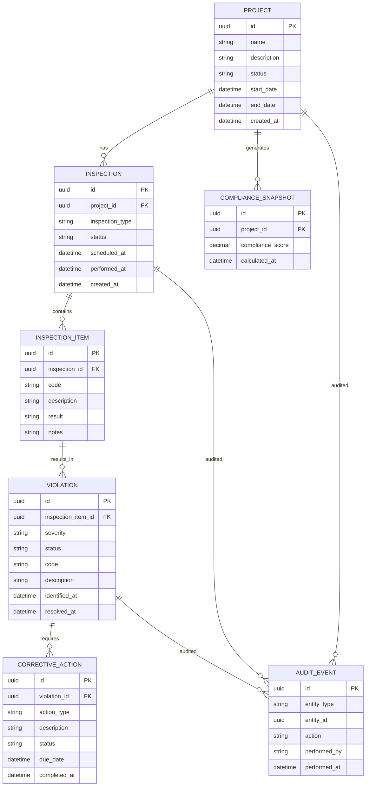

# FieldMark Domain Data Model – ERD

## Purpose
This document describes the **foundational domain schema** for FieldMark: Construction Compliance & Inspection Management System.  
It is intended as a **data‑layer design reference** and as priming context for agentic systems.  

The schema favors:
- Backend authority
- Explicit workflows
- Auditability
- Cross‑stack parity (.NET + Django)

The model is intentionally **conservative and extensible**, avoiding premature normalization while remaining enterprise‑credible.

---

## Core Domain Concepts

- **Project** – A construction job or site under compliance oversight
- **Inspection** – A scheduled or performed inspection event
- **InspectionItem** – Individual checks within an inspection
- **Violation** – A failed or non‑compliant finding
- **CorrectiveAction** – Required remediation steps
- **ComplianceSnapshot** – Materialized compliance calculations
- **AuditEvent** – Immutable audit trail record

---

## Entity Relationship Diagram (Mermaid)

---

## Design Notes

### UUID Primary Keys
- All entities use UUIDs
- Enables cross‑stack parity and offline‑safe identifiers

### Explicit State Fields
- `status` fields are explicit, enumerable, and backend‑controlled
- No implicit state transitions

### Compliance as a Snapshot
- Compliance score is materialized, not derived live
- Enables auditability and historical analysis

### Audit Events
- Audit is append‑only
- No foreign‑key enforcement to allow schema evolution

---

## Out‑of‑Scope (Deliberate)

- User / Identity schema
- Roles / permissions
- Attachments / blobs
- Notification delivery
- Historical versioning tables

These may be layered later without disturbing the core model.

---

## Status

This ERD defines the **baseline domain data contract** for FieldMark and is suitable for:
- EF Core migration ownership
- Django model mapping
- Agentic schema reasoning
- Architecture reviews
