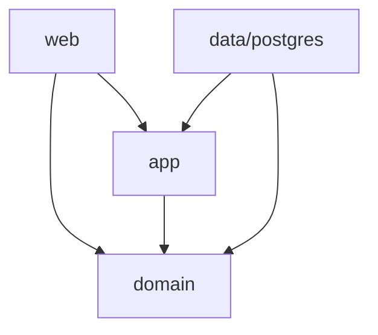
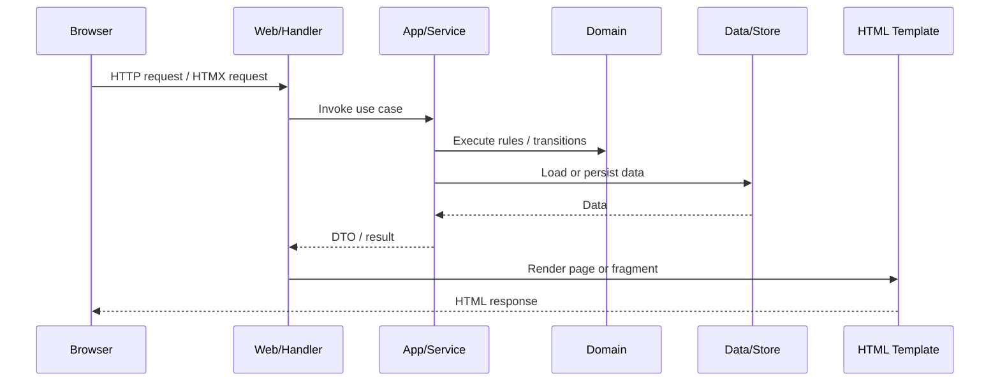

# FieldMark Fiber Architecture & Standup Guide

## Purpose

This document provides a **practical, architecture-aligned guide** for standing up a Go Fiber implementation of FieldMark inside the monorepo.

It is designed to support the same core goals as the .NET and Django implementations:

- Backend authority
- Server-driven HTML
- Minimal client-side state
- Explicit workflow ownership
- Clean separation of domain, application, persistence, and web concerns

This document is intended to act as both:
- a **setup guide** for initializing the Fiber application, and
- a **guardrail reference** for human and agentic contributors

---

## Why Fiber Is a Valid Fit for FieldMark

Fiber is a reasonable choice for a FieldMark implementation because:

- It provides strong defaults and a cohesive developer experience
- It supports server-rendered HTML using Go's standard `html/template`
- It can serve full pages, HTMX fragments, JSON endpoints, and static assets
- It is fast enough that the demo will feel highly responsive

However, Fiber must be treated as:

> an HTTP and rendering adapter, not the architecture itself.

Without constraints, Fiber can drift toward handler-centric code and business logic in request handlers. This guide exists to prevent that.

---

## Architectural Principles

The Fiber implementation must adhere to the same non-negotiable principles used elsewhere in FieldMark:

1. The backend owns truth
2. Domain logic is centralized and explicit
3. Persistence is an adapter, not a design authority
4. UI is a projection of authoritative state
5. Complexity must be earned

---

## Recommended Monorepo Placement

```text
fieldmark/
├── FieldMark/                 # .NET solution
├── fieldmark_py/              # Django implementation
├── fieldmark_go/              # Fiber implementation
├── docker/
├── docker-compose.yml
├── ui/
└── docs/
```

The Go implementation should be a peer to the .NET and Django implementations, not nested inside either.

---

## Recommended Fiber Project Layout

```text
fieldmark_go/
├── cmd/
│   └── web/
│       └── main.go
├── internal/
│   ├── domain/
│   │   ├── entities/
│   │   ├── valueobjects/
│   │   ├── enums/
│   │   └── errors/
│   ├── app/
│   │   ├── services/
│   │   ├── ports/
│   │   └── dto/
│   ├── data/
│   │   └── postgres/
│   │       ├── db.go
│   │       ├── stores/
│   │       └── models/
│   └── web/
│       ├── handlers/
│       ├── middleware/
│       ├── templates/
│       │   ├── layouts/
│       │   ├── pages/
│       │   ├── partials/
│       │   └── fragments/
│       └── static/
│           ├── css/
│           ├── js/
│           └── vendor/
├── go.mod
└── go.sum
```

This structure is intentionally layered by responsibility, not by technical fashion.

---

## Layer Responsibilities

### 1. `internal/domain`

Contains:
- Entities
- Value objects
- Domain enums
- Invariants
- State transition methods
- Domain-specific errors

Must NOT contain:
- Fiber imports
- SQL
- template rendering
- request/response structs
- web concerns

### 2. `internal/app`

Contains:
- Use-case orchestration
- Service-level workflows
- Ports/interfaces for persistence
- DTOs crossing app/web boundaries

Must NOT contain:
- HTML rendering
- direct Fiber context usage
- SQL queries

### 3. `internal/data/postgres`

Contains:
- Database connection setup
- Persistence adapters / stores
- Query implementations
- transaction coordination when necessary

Must NOT contain:
- UI logic
- domain workflow rules

### 4. `internal/web`

Contains:
- Fiber route definitions
- handlers
- middleware
- template rendering
- static asset serving
- HTMX fragment endpoints

Must NOT contain:
- business rules
- query logic beyond orchestration

---

## Dependency Direction (Hard Rule)



### Forbidden dependency directions

- `domain -> web`
- `domain -> data`
- `app -> web`
- `app -> data` concrete implementations

The application layer may depend on interfaces (ports), not concrete persistence adapters.

---

## Conceptual Request Flow



This is the preferred interaction model.

---

## How HTMX Fits

HTMX should be treated as:
- a transport enhancer for HTML fragments
- not a client-side application framework

Recommended usage:
- full page rendering for navigation
- partial HTML fragment rendering for updates
- JSON only for JavaScript islands such as AG Grid

### Allowed response types
- full HTML page
- partial HTML fragment
- JSON for widget data endpoints

### Disallowed usage patterns
- client-side state stores
- client-owned workflow logic
- REST-first UI orchestration

---

## Templating Strategy

Use Go's standard `html/template` via Fiber's HTML template renderer.

Template philosophy:
- stay close to literal HTML
- use layouts and partials
- avoid DSLs or component languages that obscure markup

Recommended template organization:

```text
templates/
  layouts/
    base.html
  pages/
    dashboard.html
    projects_index.html
    project_detail.html
  fragments/
    compliance_tile.html
    violation_row.html
    audit_log.html
  partials/
    nav.html
    header.html
    footer.html
```

### Template guidance
- pages represent full route surfaces
- fragments represent HTMX swap targets
- partials represent shared markup only

---

## Suggested Initial Screens to Support

1. Dashboard
2. Project list
3. Project detail
4. Inspection detail
5. Violation detail
6. Audit log fragment
7. Minimal admin/configuration screens

This aligns the Fiber version with the .NET and Django implementations conceptually.

---

## Persistence Guidance

The Go implementation may use small, explicit store interfaces because Go does not provide EF Core-style persistence abstractions.

### Acceptable
- `ProjectStore`
- `InspectionStore`
- `ViolationStore`

### Not acceptable
- generic repositories
- layered repository abstractions for their own sake
- “clean architecture” ports everywhere with no clear need

The store interfaces should be:
- domain-specific
- narrow
- obvious

---

## Recommended Setup Sequence

### 1. Initialize the module

```bash
go mod init github.com/your-org/fieldmark_go
```

### 2. Add initial dependencies

Suggested minimum:
- Fiber
- Fiber HTML template engine
- Postgres driver / query tooling of your choice

### 3. Create the folder layout

Scaffold the `cmd/` and `internal/` directories before writing handlers.

### 4. Wire Postgres connectivity

Use the shared Docker Postgres instance already running for the monorepo.

### 5. Add template rendering

Stand up a base layout and one minimal page to validate:
- routing
- template rendering
- static assets

### 6. Stop before feature development

Do not implement real workflows until planning and guardrails are finalized.

---

## Static Asset Strategy

The Fiber implementation should mirror the other stacks:

- no public CDN dependency
- local static asset serving only
- vendored HTMX and AG Grid assets
- shared Tailwind build output may be copied or symlinked into `internal/web/static/css/`

---

## Architectural Guardrails for Fiber

### Allowed
- Thin handlers
- Explicit app services
- Small persistence ports
- HTML-first responses
- HTMX fragments
- JS islands only where needed

### Prohibited
- Business logic in handlers
- Fiber context escaping the web layer
- Fat middleware containing workflow logic
- generic repository abstractions
- client-side workflow orchestration
- framework-driven “magic” replacing explicit rules

---

## Developer and Agent Rules

A human or coding agent working on the Fiber implementation must follow these rules:

1. Do not place business rules in Fiber handlers
2. Do not let `fiber.Ctx` leave the web layer
3. Do not let persistence details leak into domain code
4. Prefer HTML responses over JSON unless a JS island requires JSON
5. Keep template files close to literal HTML
6. Add structure before adding abstractions
7. If a pattern requires explanation, it is likely too complex for this project

---

## Suggested Initial Standup Milestone

The Fiber implementation is “standup complete” when the following are true:

- module initialized
- folder layout in place
- Fiber app starts successfully
- Postgres connection validated
- base layout renders
- one page route works
- one HTMX fragment route works
- local static assets are served

No domain logic is required at this milestone.

---

## Final Guidance

The Fiber implementation should be used to demonstrate:

- that backend authority is portable across ecosystems
- that HTML-over-the-wire is not tied to .NET or Django
- that modern UX does not require SPA architecture

If the Fiber version is added, it should reinforce the same FieldMark thesis as the other stacks:

> one authoritative backend, many replaceable UI projections.

---

## Status

Accepted – Fiber standup and architecture guide
