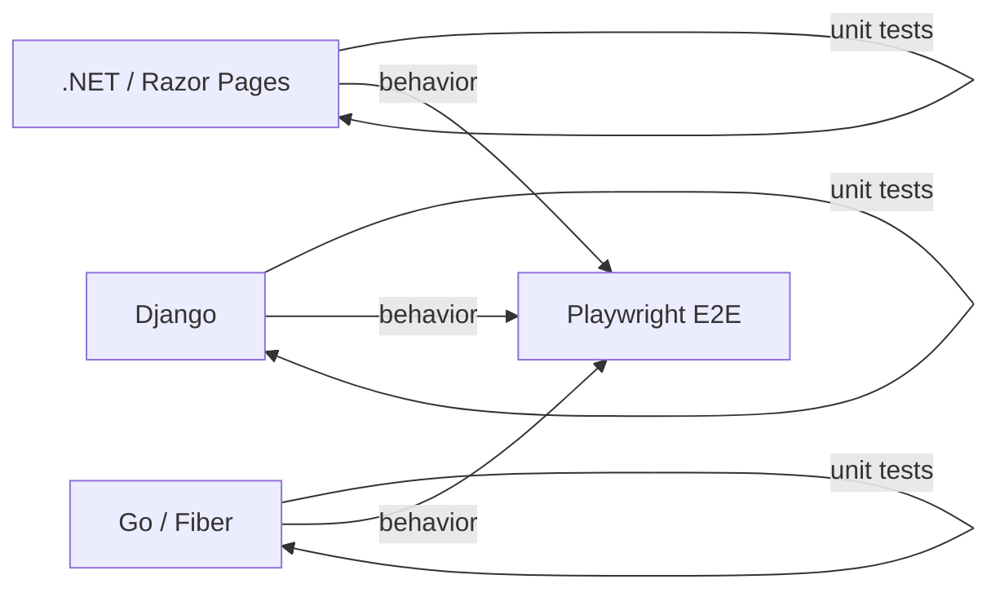

# FieldMark Multi-Backend Unit Testing Strategy

## Purpose

This document defines the **unit testing strategy** for the FieldMark monorepo, which contains multiple backend implementations:

- ASP.NET Core / Razor Pages (.NET)
- Django (Python)
- Go (Fiber)

The goal is to ensure that **each implementation feels native to its ecosystem**, while still validating the same underlying architectural principles:

- backend authority
- explicit domain rules
- deterministic workflows
- minimal framework leakage into business logic

Unit tests focus on *domain and application behavior*, not HTTP wiring or UI rendering.

---

## Testing Philosophy (Shared)

Across all stacks:

- Unit tests validate **domain rules and application logic**
- Framework plumbing (routing, templates, middleware) is not unit-tested
- Browser-visible behavior is validated via **Playwright E2E tests**, not unit tests
- Tests should be fast, deterministic, and runnable locally without infrastructure

Each stack uses its **idiomatic testing framework** and conventions.

---

## Monorepo-Level View



Each backend validates its own logic internally, while Playwright validates shared workflows externally.

---

## .NET Unit Testing Strategy

### Framework

- **xUnit** is the preferred framework
- Optional: FluentAssertions for expressive assertions

### Project Structure

```text
FieldMark/
├── FieldMark.Domain/
│   └── Tests/
│       ├── ProjectTests.cs
│       └── ViolationTests.cs
├── FieldMark.Application/
│   └── Tests/
│       ├── ComplianceServiceTests.cs
│       └── AuthorizationTests.cs
└── FieldMark.Tests.sln
```

### What to Test

- domain entity invariants
- state transitions
- application services
- authorization rules

### What Not to Test

- Razor Pages
- ViewComponents
- EF Core configuration

---

## Django Unit Testing Strategy

### Framework

- **pytest**
- **pytest-django**

These provide a modern, explicit testing style that avoids inheritance-heavy test classes.

### Recommended Folder Structure

```text
fieldmark_py/
├── projects/
│   ├── domain.py
│   ├── services.py
│   └── tests/
│       ├── test_domain.py
│       └── test_services.py
├── inspections/
│   └── tests/
├── conftest.py
└── pytest.ini
```

### Minimal pytest Configuration

```ini
[pytest]
DJANGO_SETTINGS_MODULE = fieldmark.settings
python_files = test_*.py
addopts = -ra
```

### What to Test

- model methods enforcing rules
- domain service functions
- compliance calculations
- permission logic

### What Not to Test

- templates
- Django admin UI
- URL routing
- HTMX wiring

---

## Go (Fiber) Unit Testing Strategy

### Framework

- Go standard library **testing** package

No third-party test framework is required.

### Recommended Folder Structure

```text
fieldmark_go/
├── internal/
│   ├── domain/
│   │   ├── violation.go
│   │   └── violation_test.go
│   ├── app/
│   │   ├── compliance_service.go
│   │   └── compliance_service_test.go
│   └── data/
│       └── postgres/
│           └── project_store_test.go
```

### Go Test Skeleton Example

```go
package domain

import "testing"

func TestViolationResolve(t *testing.T) {
    v := NewViolation("open")

    err := v.Resolve("user-123")
    if err != nil {
        t.Fatalf("unexpected error: %v", err)
    }

    if v.Status != "resolved" {
        t.Errorf("expected status 'resolved', got '%s'", v.Status)
    }
}
```

### What to Test

- domain structs and methods
- application services
- rule enforcement

### What Not to Test

- Fiber routing
- middleware chains
- HTML template rendering

---

## Relationship to E2E Testing

Unit tests validate *internal correctness*.

Playwright E2E tests validate:

- full workflows
- UI-visible state changes
- cross-backend parity

Unit tests should never duplicate E2E scenarios.

---

## Guardrails for Contributors and Agents

- Unit tests must test **behavior**, not frameworks
- Tests must live next to the code they validate
- Avoid over-mocking HTTP or database layers
- Prefer pure functions and domain objects where possible
- Keep tests readable and idiomatic to the language

---

## Success Criteria

The unit testing setup is considered complete when:

- each backend can run its unit tests independently
- tests fail fast and clearly on rule violations
- no unit test requires browser automation or Playwright
- contributors can add tests without learning a new paradigm

---

## Status

Drafted – FieldMark multi-backend unit testing strategy
