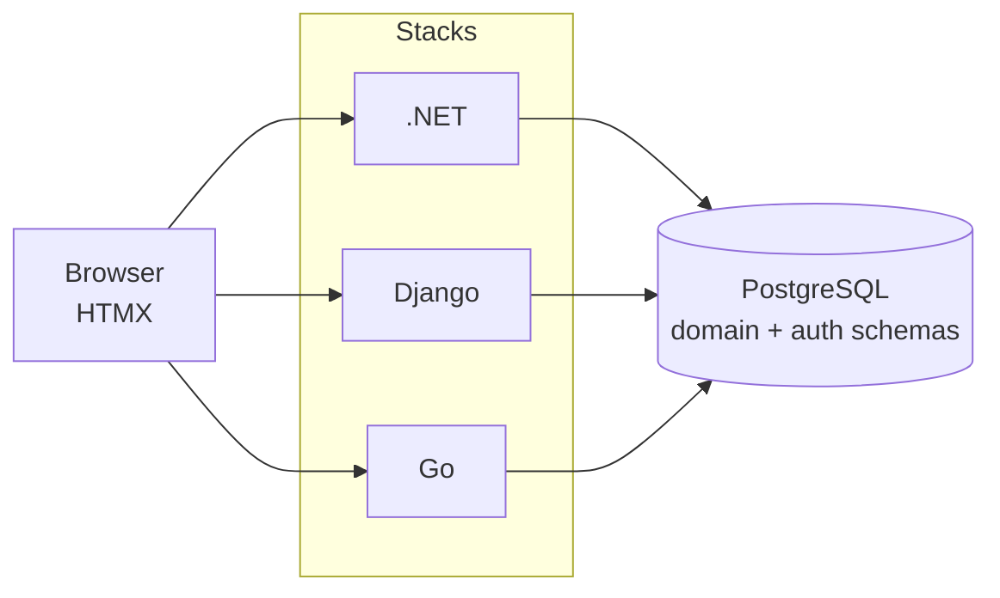

# FieldMark Architecture

FieldMark demonstrates server-authoritative architecture using three parallel stacks (all HTMX + server-rendered) against one PostgreSQL database.

## Three-Stack Constraint

All stacks expose identical routes, HTMX target IDs, AG Grid contracts, audit entry shapes, and domain method names. Diverging is a defect.

Canonical state-transition methods: `start`, `complete`, `cancel`, `place_on_hold`, `resume`, `close`, `assign`, `submit_corrective_action`, `approve_resolution`, `reject_resolution`, `void`.

## Database Schema Ownership

Schema-level isolation:

| Schema | Owner |
|---|---|
| `domain` | Infrastructure SQL init scripts (not frameworks) |
| `django_auth` | Django stack |
| `dotnet_auth` | .NET stack |
| `fiber_auth` | Go stack |

`domain` schema is framework-agnostic. No FKs from domain to auth tables; user refs are opaque IDs.

## Canonical Request Flow (Mutating Handlers)

1. Authorize (role + ownership)
2. Begin transaction
3. Load aggregate root
4. Call entity method (raises typed exception on violation)
5. Append `AuditEntry` (same tx)
6. Recompute `compliance_score` on project (if affected)
7. Commit
8. Render HTMX partial or page

Business logic belongs on the entity.

## Domain Aggregates

Four aggregates: **Project**, **Inspection**, **Violation** (contains **CorrectiveAction**). Full state machines and invariants in planning artifacts.

## Canonical Audit Actions

`ProjectCreated`, `ProjectClosed`, `ProjectPlacedOnHold`, `ProjectResumed`, `InspectionScheduled`, `InspectionStarted`, `InspectionCompleted`, `InspectionCancelled`, `ViolationOpened`, `ViolationAssigned`, `ViolationVoided`, `CorrectiveActionSubmitted`, `CorrectiveActionTakenForReview`, `CorrectiveActionApproved`, `CorrectiveActionRejected`.

Stored verbatim in `domain.audit_entry.action`.

## Canonical HTMX Target IDs

`#project-detail`, `#project-list`, `#violation-detail`, `#violation-list`, `#inspection-list`, `#audit-log`, `#compliance-tile` (OOB), `#corrective-action-form`, `#corrective-action-list`, `#flash-region`.

## HTMX Patterns

- Partials: single root element with stable id (match across stacks)
- State changes: `<button hx-post>`, never links
- `hx-swap-oob` only for header tiles
- Server decides button presence/absence vs disabled
- Domain exceptions → HTTP 409 + partial with error
- Validation errors → HTTP 422 + form partial + aria-invalid

## AG Grid

Server-side row model. Contract: `{ "rows": [...], "lastRow": N }`. Row selection → HTMX detail load. No business logic in grid config.

## Shared Front-End Assets

`fieldmark_shared/` is source of truth:

- Tailwind CSS: src → dist (committed)
- Vendor: AG Grid, HTMX

Symlinked into each stack's vendor/ static dir. See layout table in root CLAUDE.md if needed.

See also: Hard Rules, Key References in CLAUDE.md and planning docs.
