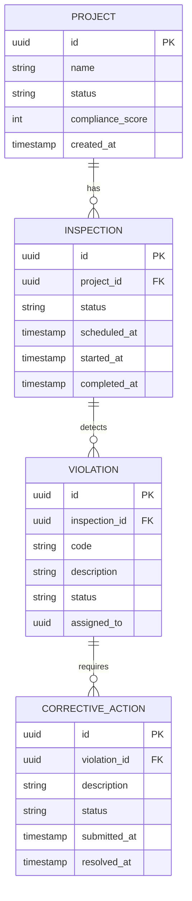
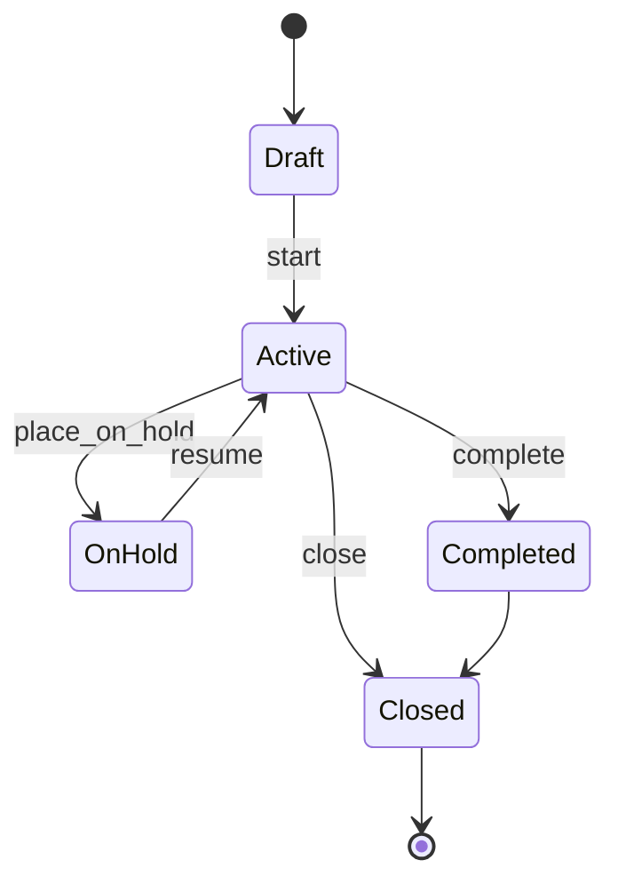
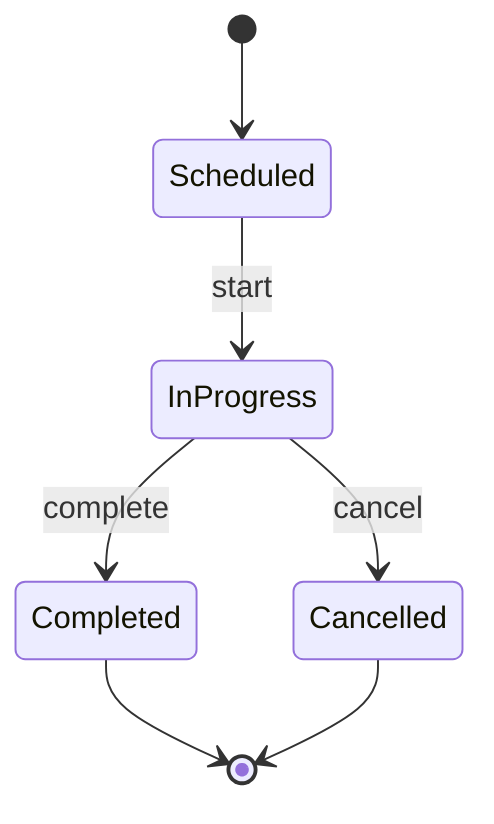
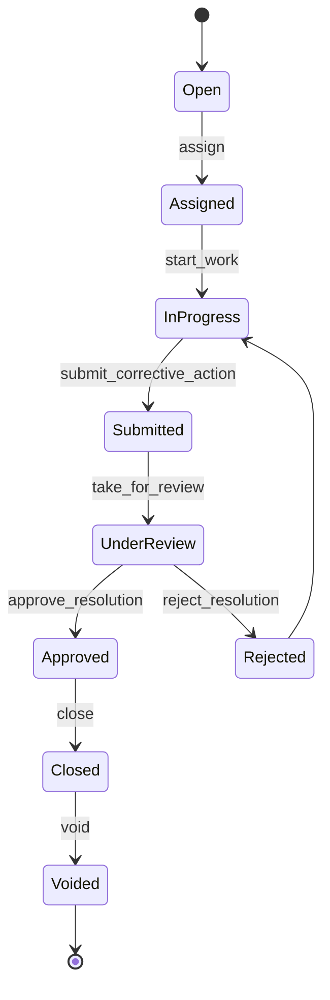

# FieldMark Domain Model

This document describes the core business entities, their relationships, and state machines.

## Aggregates Overview

## Project State Machine

**Valid transitions**: `start`, `complete`, `cancel`, `place_on_hold`, `resume`, `close`

## Inspection State Machine

## Violation + Corrective Action Flow

## Key Invariants

- A `Violation` must have at least one `CorrectiveAction` before resolution.
- `compliance_score` on `Project` is recomputed after any state change affecting open violations.
- All state transitions append an `AuditEntry` in the same transaction.
- User references are opaque IDs (no FKs from `domain` to auth schemas).

See `domain/` tables in PostgreSQL for exact column definitions.
