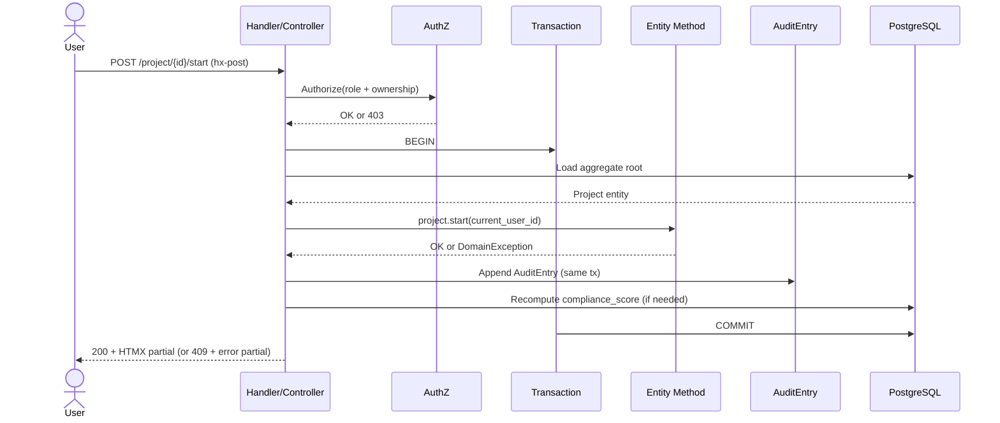

# FieldMark Canonical Request Flow

All mutating operations follow the same lifecycle across every stack.

## Sequence Diagram (Mutating Handler)

## Step-by-Step Rules

1. **Authorize first** — role + ownership check before any data load.
2. **Transaction boundary** — entire operation is atomic.
3. **Load aggregate** — always start from the root.
4. **Call entity method** — business logic lives here; raises typed exception on violation.
5. **Audit in same tx** — `domain.audit_entry` write is mandatory.
6. **Recompute derived state** — e.g., `compliance_score` after violation changes.
7. **Commit then render** — only render after successful commit.
8. **HTMX response** — return partial or full page; use `hx-swap-oob` only for header tiles.

## Error Handling

- Domain rule violation → HTTP 409 + error partial
- Validation failure → HTTP 422 + form partial with `aria-invalid`
- Authorization failure → HTTP 403

## Non-Mutating (Read) Requests

Read paths bypass the full flow:
- Direct ORM/ SQL query
- Render partial or page
- No transaction, no audit entry

See [Architecture](architecture.md) for HTMX target IDs and patterns.
