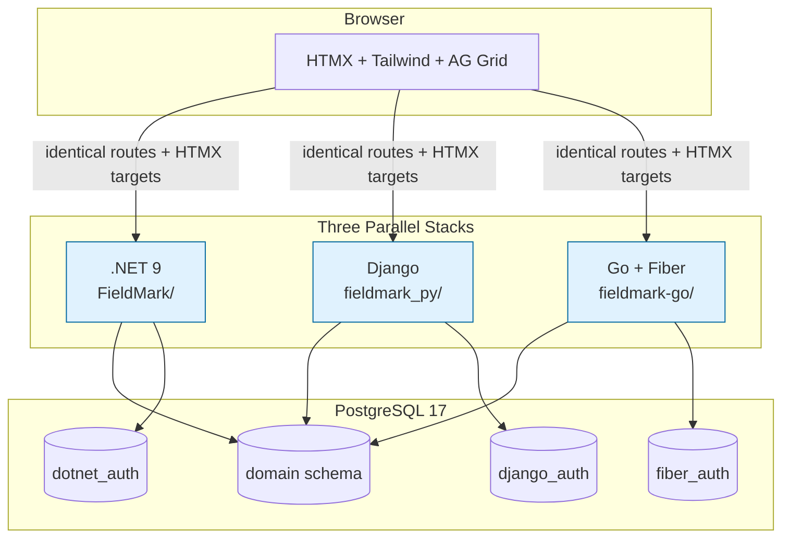

# FieldMark Overview

FieldMark is a reference implementation showing how to build a **server-authoritative, HTMX-first** construction compliance and inspection management system using three parallel backend stacks against a single PostgreSQL database.

## What Problem Does It Solve?

Construction projects require rigorous inspection tracking, violation management, and corrective action workflows. FieldMark demonstrates a clean architecture that:

- Keeps **all business logic on the server** (entities, not services)
- Uses **HTMX for dynamic UX** without client-side frameworks
- Proves **stack symmetry** — identical behavior across .NET, Django, and Go
- Maintains a **framework-agnostic domain schema**

## High-Level Architecture

## Core Principles

- **Domain first**: Business rules live on aggregates (`Project`, `Inspection`, `Violation`, `CorrectiveAction`)
- **Thin handlers**: Controllers/views simply authorize → call entity method → append audit → render
- **No client state**: Every interaction is a server round-trip
- **Symmetry by design**: Routes, HTMX IDs, AG Grid contracts, audit strings, and method names are identical across stacks

## Who Should Read This?

- **New developers** onboarding to any stack
- **Curious readers** who saw a presentation or demo
- **Contributors** wanting to add features while preserving invariants

## Quick Links

| Document | Purpose |
|----------|---------|
| [Getting Started](getting-started.md) | Run the app in 5 minutes |
| [Architecture](architecture.md) | Deep technical details and invariants |
| [Domain Model](domain-model.md) | Aggregates, state machines, relationships |
| [Request Flow](request-flow.md) | Canonical mutating request lifecycle |
| [Hard Rules](hard-rules.md) | Non-negotiable constraints |

Start with [Getting Started](getting-started.md) to run the system, then explore the domain and flows.
