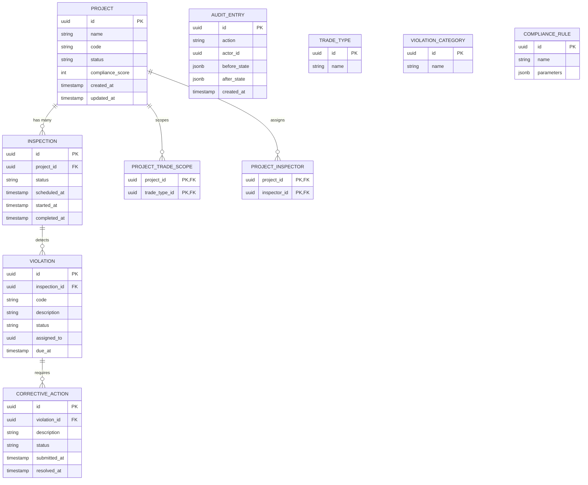

# Persistence Schema (Domain Layer)

This document describes the canonical database schema for the `domain` schema in PostgreSQL. The schema is owned by infrastructure SQL init scripts (`docker/postgres/init/`), not by any application framework.

## Schema Ownership

| Schema       | Owner                          | Purpose                          |
|--------------|--------------------------------|----------------------------------|
| `domain`     | Infrastructure SQL             | Business entities and aggregates |
| `django_auth`, `dotnet_auth`, `fiber_auth` | Framework-local migrations | Authentication and authorization |
| `infra`      | Infrastructure                 | Shared infrastructure objects    |

**Key rules:**
- No foreign keys from `domain.*` tables into any `*_auth` schema.
- User references are stored as opaque `uuid` values only.
- All tables use `snake_case` naming.

## Entity Relationship Diagram

## Core Tables Summary

### Primary Aggregates
- `domain.project`
- `domain.inspection`
- `domain.violation`
- `domain.corrective_action`

### Supporting Tables
- `domain.audit_entry` — append-only audit trail (written in same transaction as every mutation)
- `domain.trade_type`, `domain.violation_category`, `domain.compliance_rule` — reference data
- Junction tables: `domain.project_trade_scope`, `domain.project_inspector`

## Naming & Type Conventions

- **Tables & columns**: `snake_case`
- **Primary keys**: `uuid` (generated in application code)
- **Timestamps**: `timestamptz`
- **Enums**: stored as `varchar` + `CHECK` constraints (not native PostgreSQL enums)
- **JSON columns**: `jsonb` for flexible state snapshots in `audit_entry`

## Invariants Enforced at the Database Level

- `compliance_score` on `Project` is recomputed after relevant state changes.
- Every mutating operation writes exactly one `AuditEntry` row.
- A `Violation` must have at least one `CorrectiveAction` before it can be resolved.

## Related Documentation

- [Domain Model](domain-model.md) — State machines and business invariants
- [Architecture](architecture.md) — Request flow and schema ownership rules
- [Hard Rules](hard-rules.md) — Non-negotiable persistence constraints

See the init scripts in `docker/postgres/init/` for the authoritative DDL.
